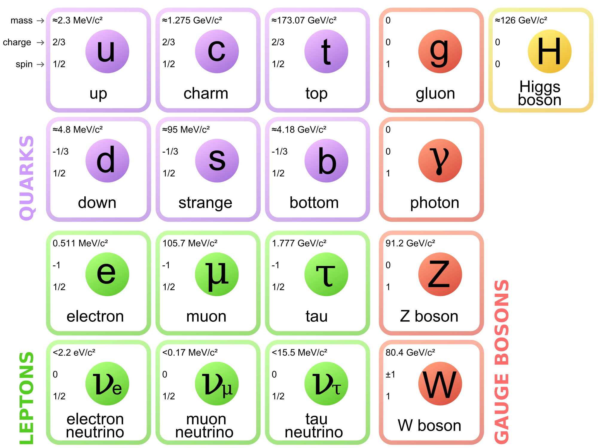
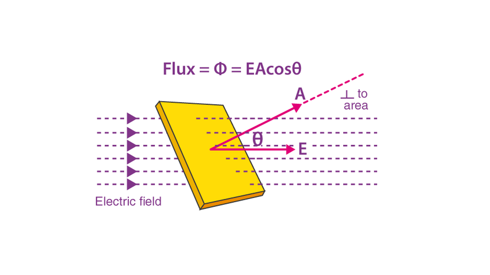
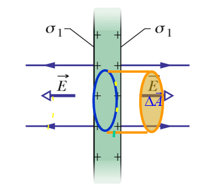
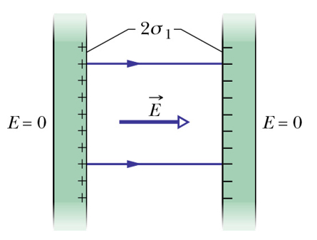
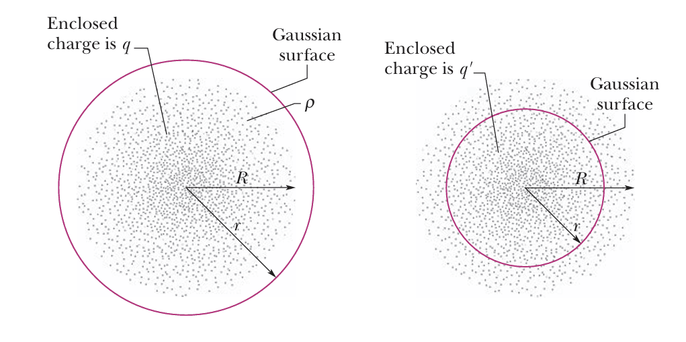
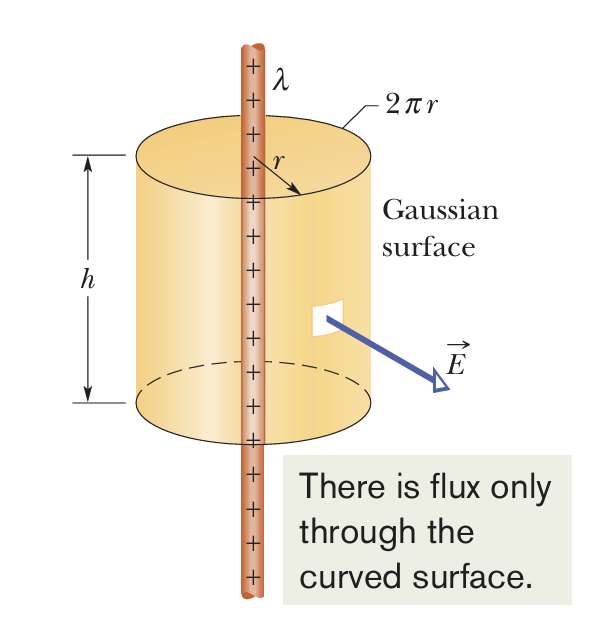
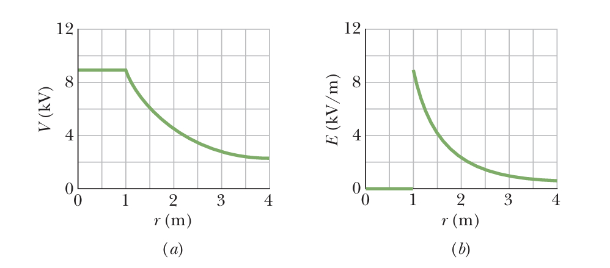

# General Physics III (2)

## PREFACE

- 请注意：本笔记仅仅包含 2024 年第二学期大学物理（Ⅲ）命题计划中的内容, 没有详细给出的部分并不代表不在教学范围内. 

## Chapter 18 Temperature, Heat and 1st Law

## Chapter 19 Kinetic Theory of Gas

## Chapter 20 Entropy and 2nd Law

## Chapter 21 Coulomb's Law

### Electric Charge

An intrinsic characteristic of the fundamental particles. 基本粒子的内禀属性

- Two kinds of electric charge: Positive and Negative. 正负电荷

- Charges with the same electrical sign **repel** each other, opposite electrical signs **attract** each other. 同性相斥, 异性相吸

**Electrically neutral** 电中性

**Charged** 带电

元电荷: $e =1.602 176 487 \times 10^{-19} C$

电荷是量子化的: A physical quantity has only discrete values. 分立值, 即 $q = ne,\ n \in\mathbb{Z}$.

- 夸克带电 $\pm2/3$
- 质子带电 $+1$
- 中子不带电
- 电子带电 $-1$

**Charge is neither created nor destroyed **电荷不可产生消灭, **but it can be transferred from one** body to the other 电荷可传输.

In any process, the net algebraic sum of the amount of electric charge remains **constant**. 电荷量的代数和是常量. 

### Conductors and Insulators

Conductors: 绝缘体

Insulators: 导体

### Coulomb's Law

Two charged particles (point charges) at rest in a vaccum 对于真空中静止的两个点电荷 $q_1,q_2$, 若其距离为 $r$, 则有静电力
$$
F = k\frac{\vert q_1\vert\vert q_2\vert}{r^2}
$$
这就是 Coulomb's Law.

Electrostatic constant 静电常数: $k = 8.99\times 10^9N\cdot m^2\cdot C^{-2}$

Permittivity 介电常数: $\epsilon_0 = 8.85418781762\times10^{-12}N^{-1}m^{-2}C^2$, 满足 $\displaystyle k = \frac{1}{4\pi\epsilon_0}$.

**Shell theorem 1:** A shell of **uniform** charge attracts or repels a charged particle that is **outside** the shell as if all the shell’s charge were concentrated at its center. 壳外电荷受力等价于电荷聚集于球心对外电荷的作用力. 

If a charged particle is located **inside** a shell of uniform charge, there is **no net electrostatic force** on the particle from the shell. 壳内电荷不受静电力. 

## Chapter 22 Electric Fields

### Electric Field

Scalar fields **标量场**: temperature T(x,y,z); pressure p(x,y,z).

Vector fields **矢量场**: velocity of a fluid, gravitation.

电场强度的定义: We define the electric field of charged particle *q* at point P as: 
$$
\vec{E} = \frac{\vec{F}}{q_0} = \frac{1}{4\pi\epsilon_0}\frac{q}{r^2}\hat{r}
$$
At any point, the **tangent** of the electric field lines gives the **direction** of the electric field. **电场线的切线方向为该点的电场方向. ** 

The number of lines per unit area in a plane perpendicular to the lines (**density**) is proportional to the **magnitude** of the electric field. **电场线密度正比于电场强度. **

### Electric Field due to Point Charges

电场强度遵循矢量叠加原理: The electric field due to several particles can be calculated by the principle of superposition. 
$$
\vec{E_{net}} = \vec{E_1}+\vec{E_2}+\cdots+\vec{E_n} = \sum_{i=1}^{n}\frac{q_i}{4\pi\epsilon_0 r_i^2}\hat{r_i}
$$

### A Point Charge in an Electric Field

电场中的点电荷所受到的库仑力. When a charged particle is placed in an external electric field, the electrostatic force acts on the particle is 
$$
\vec{F} = q\vec{E}
$$
**Measuring the Elementary Charge – Millikan oil drop experiment 密立根油滴实验**

证明了元电荷 $e =1.602 176 487 \times 10^{-19} C$. 

## Chapter 23 Gauss' Law

### Electric Flux 

The flux of an electric field passing through an area element is
$$
\text{d}\Phi = \vec{E}\cdot\text{d}\vec{A}
$$
$\text{d}\Phi$ can be **positive**, **negative** or **zero** depending on the **direction of the vectors**. 

Flux through a surface: $\displaystyle \Phi = \iint\vec{E}\cdot\text{d}\vec{A}$

For a closed surface, outward is positive: $\displaystyle \Phi = \oiint \vec{E}\cdot\text{d}\vec{A}$

点电荷的电通量: A spherical **closed surface** with a point charge at its center: 
$$
\Phi = \oiint \vec{E}\cdot\text{d}\vec{A} = EA = 4\pi r^2\cdot E = 4\pi r^2\cdot \frac{1}{4\pi\epsilon_0}\frac{q}{r^2} = \frac{q}{\epsilon_0}
$$
It holds for any closed surface that encloses the charge **q** and for any location of q inside **A**.

### Gauss’ Law 

静电场中的高斯定理: 在真空中的任意静电场内, 通过任一闭合曲面S的电通量, 等于该闭合曲面所包围的电荷电量的代数和除以真空介电常数, 而与闭合曲面外的电荷无关.
$$
\Phi_e = \oiint \vec{E}\cdot\text{d}\vec{A} = \frac{1}{\epsilon_0}\sum{q_i} = \frac{q_{enc}}{\epsilon_0}
$$

### Electric Field of a Charged Conductor 

In electrostatic equilibrium, the electric field inside a conductor is zero. 静电平衡时**导体内部场强处处为零**. 

Excess charge on a conductor is entirely on the **conductor’s surface**. 多余电荷只能在表面. 

一个很经典的例子是, 若存在一个均匀的空心球体, 其内部有一个不在球心的点电荷, 那么无论该电荷在哪里, 最终球壳外表面上的电荷分布也是均匀的. 

对于一块均匀金属板, 其上带某种电荷, 那么取其上一个圆柱体, 其产生的电场强度如下
$$
\Phi_E = E\cdot A(\text{Left}) +E\cdot A(\text{Right}) = 2EA = \frac{q_{env}}{\epsilon_0} = \frac{\sigma_1 A}{\epsilon_0} \\
E_1 = \frac{\sigma_1}{2\epsilon_0}
$$
这是金属板单侧电荷产生的电场强度, 因此金属板两侧电荷产生的电场强度为
$$
E = 2E_1 = \frac{\sigma_1}{\epsilon_0} = \frac{\sigma}{2\epsilon_0}(\sigma = \pm2\sigma_1)
$$

对于上图中的两块带不同电荷的金属板, 其可以视为两个金属板所产生的电场的合成, 因此对于整体, 有
$$
E = 2\frac{\sigma_1}{\epsilon_0} = \frac{\sigma}{\epsilon_0}(\sigma = \pm2\sigma_1)
$$

### Electric Field of a Charged **Insulator** with Symmetry 

The Gaussian surface should match the symmetry of the charge so that to simplify the integral. 

以下是几种常见的对称情形电场强度

- **Spherically symmetric charges 球对称**

  

  对于均匀的空心金属球壳而言, 由于静电屏蔽, 其内部无电场强度, 而外部电场等价于球心处放置的点电荷所产生的电场, 因此有
  $$
  E = 
  \begin{cases}
  0 & r<R \\
  \displaystyle \frac{1}{4\pi\epsilon_0}\frac{1}{r^2} & r>R
  \end{cases}
  $$
  对于均匀的实心金属球体而言, 在 $r<R$ 时, 可以在 $r$ 处使用高斯定理, 此时有
  $$
  \oiint\vec{E}\cdot\text{d}\vec{A} = 4\pi r^2E = \frac{q'}{\epsilon_0} \\
  E = \frac{q'}{4\pi\epsilon_0r^2} = \frac{\frac{r^3}{R^3}q}{4\pi\epsilon_0r^2} = \frac{r}{4\pi\epsilon_0R^2}
  $$
  

  在 $r>R$ 时, 实心金属球体产生的外部电场等价于球心处放置的点电荷所产生的电场, 因此有
  $$
  E = 
  \begin{cases}
  \displaystyle (\frac{1}{4\pi\epsilon_0}\frac{q}{R^3})r & r<R \\
  \displaystyle \frac{1}{4\pi\epsilon_0}\frac{q}{r^2} & r>R
  \end{cases}
  $$

- **Cylindrically symmetric charges 柱对称**

  

  对于半径为 $R$, 均匀的带电金属棍, 研究其附近的圆柱形区域电场强度. 

  在 $r>R$ 时, 有
  $$
  \oiint\vec{E}\cdot\text{d}\vec{A} = 2\pi rh\cdot E = \frac{q}{\epsilon_0} = \frac{\lambda r}{\epsilon_0} \\
  $$
  在 $r<R$ 时, 有
  $$
  q' = \frac{r^2}{R^2}q
  $$
  因此, 就有
  $$
  E =
  \begin{cases}
  \displaystyle \frac{\lambda}{2\pi\epsilon_0 r} & r>R \\
  \displaystyle \frac{\lambda r}{2\pi\epsilon_0 R^2}  & r<R
  \end{cases}
  $$

- **Planar symmetric charges 平面对称**

  

  如图所示, 选取关于平面对称的圆柱体作为高斯面, 就有
  $$
  E = \frac{\sigma}{2\epsilon_0}
  $$
  参考[此处](#Electric Field of a Charged Board). 

## Chapter 24 Electric Potential

### Electric Potential & Potential Energy

Electric force is **conservative** and thus has an associated **potential energy**.

**Conservative Forces** is path independent and always have **zero curl** $\nabla\times\vec{F} = 0$. 

Circuital theorem of electrostatic field **环路定理**

The difference of the electric potential energy of a system changing from an initial configuration to a final configuration is related to the work done *W* by the **electrostatic force** on the system by
$$
\Delta{U} = U_f-U_i = -W
$$
The potential energy per unit charge at a point in an electric field set up by other objects is called the **electric potential** of the field.
$$
V = \frac{U}{q} \\
\Delta{V} = V_f - V_i = -\int_{i}^{f}\vec{E}\cdot\text{d}\vec{s}
$$
Electrostatic force is the negative gradient of electric potential energy.
$$
\vec{F} = -\nabla U = -\left(\frac{\partial U}{\partial x}\vec{i}+\frac{\partial U}{\partial y}\vec{j}+\frac{\partial U}{\partial z}\vec{k}\right)
$$
Electric field is the negative gradient of electric potential.
$$
\vec{E} = -\nabla V = -\left(\frac{\partial V}{\partial x}\vec{i}+\frac{\partial V}{\partial y}\vec{j}+\frac{\partial V}{\partial z}\vec{k}\right)
$$
And we have
$$
\vec{F} = q\vec{E} \\
U = qV
$$
电势的单位是电子伏特 electron-volt. $1eV = 1.60\times 10^{-19}J$. 

No work is done on a charged particle by the electric field when the particle moves between two points on the **same equipotential surface**. 同一等势面上的移动不做功. 

The same work is done by the field on a charged particle over any path connecting **two equipotential surfaces**. 跨越不同等势面的移动做工相同. 

**Equipotential surface** must be **perpendicular** **to the electric field,** otherwise a charge will experience an electric force parallel to the surface and there is work done by the electric field on the same surface. 等势面垂直于电场线. 

### Electric Potential due to Point Charges

**Potential due to a point charge** **单点电荷的电势**

在距离点电荷 $r$ 处，有
$$
E(r) = \frac{q}{4\pi\epsilon_0r^2} \\
V(r) = -\int E(r)\text{d}r = \frac{q}{4\pi\epsilon_0r}, V(\infty) = 0
$$
**Potential due to several point charges** **多点电荷的电势**

简单来说，带电体系静电场中一点的电势等于每一点电荷单独存在时在该点的电势的代数和。也就是说
$$
V(r_1,r_2,\cdots,r_n) = \frac{1}{4\pi\epsilon_0}\sum_{i=1}^{N}\frac{q_i}{r_i}
$$

### Calculating Potential from Field

**Work** done by the field on a charge. 
$$
\text{d}W = \vec{F}\cdot\text{d}\vec{s} = q_0\vec{E}\cdot\text{d}\vec{s}
$$
The change of the **potential energy**
$$
\Delta{U} = -q_0\int_{i}\vec{E}\cdot\text{d}\vec{s}
$$
对于均匀的实心金属球而言(参考[此处](#Spherically symmetric charges))，其电势和电压如下

$$
V(r) = 
\begin{cases}
\displaystyle -\int_{\infty}^{r}\frac{q}{4\pi\epsilon_0 r^2}\text{d}r &= \displaystyle \frac{q}{4\pi\epsilon_0 r} & r>R\\
\displaystyle -\int_{\infty}^{R}\frac{q}{4\pi\epsilon_0 r^2}\text{d}r - \int_{R}^{r}0\text{d}r &= \displaystyle \frac{q}{4\pi\epsilon_0 R} & r<R\\
\end{cases}
$$

### Calculating Field from Potential

The electric field is perpendicular to the equipotential surfaces and points to the direction in which the **potential decreases.**
$$
\text{d}V = -E\text{d}s \\
E = -\frac{\partial V}{\partial s}
$$
梯度计算参考[此处](#Calculate Electric Field by Gradient). 

## Chapter 25 Capacitance

### Calculating Capacitance

### Capacitors in Parallel and in Series

### Energy of Electric Field

## Chapter 26 Current and Resistance

## Chapter 27 Circuits

## Chapter 28 Magnetic Fields

### Circular motion of a charged particle

### Crossed fields

### Magnetic force on current-carrying wire

## Chapter 29 Magnetic fields due to currents

### Calculating magnetic fields by Ampere's law

### Solenoids

## Chapter 30 Induction and Inductance

### Faraday's Law of Induction

### Inductor and Inductance

## Chapter 31 Electromagnetic Oscillations and AC

## Chapter 32 Maxwell's equations

### Induced Magnetic Field

### Displacement Current

### Maxwell’s Equations

## Chapter 33 Electromagnetic Waves

### Electromagnetic Waves

### Energy Transport and Poynting Vector

## Chapter 37 Relativity

### The Relativity of Time

### The Relativity of Length

### The Lorentz Transformation

### Momentum and Energy

## Chapter 38 Photons and Matter Waves

### Photoelectronic effect

### Compton scattering

### Schrodinger's Equation

## Chapter 39 More about Matter Waves

### 1D Infinite Potential Well

### Hydrogen Atom

## Chapter 40 All about Atoms

### Orbital Angular Momentum

### Spin Angular Momentum