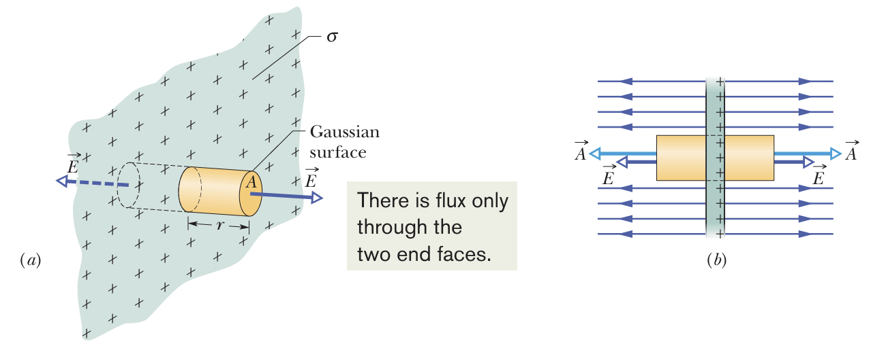
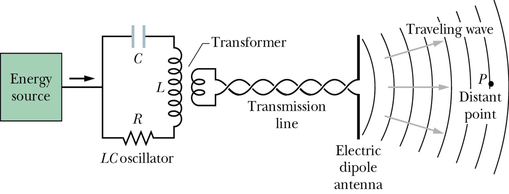
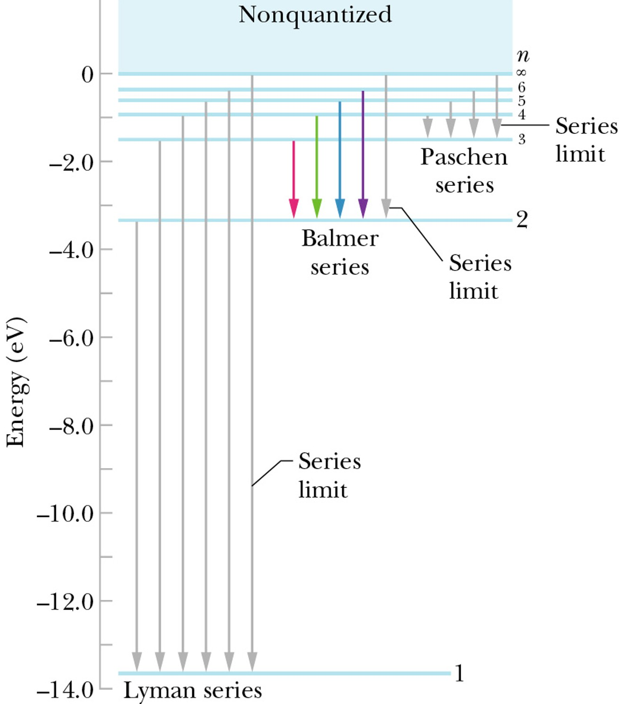

# General Physics III (2)

## PREFACE

- 请注意：本笔记仅仅包含 2024 年第二学期大学物理（Ⅲ）命题计划中的内容, 没有详细给出的部分并不代表不在教学范围内. 
- 带 * 的章节是可能对整章学习有影响, 但不在考纲中的内容. 

## Chapter 18 Temperature, Heat and 1st Law

## Chapter 19 Kinetic Theory of Gas

## Chapter 20 Entropy and 2nd Law

## Chapter 21 Coulomb's Law

### Electric Charge

An intrinsic characteristic of the fundamental particles. 基本粒子的内禀属性

- Two kinds of electric charge: Positive and Negative. 正负电荷

- Charges with the same electrical sign **repel** each other, opposite electrical signs **attract** each other. 同性相斥, 异性相吸

**Electrically neutral** 电中性

**Charged** 带电

元电荷: $e =1.602 176 487 \times 10^{-19} C$

电荷是量子化的: A physical quantity has only discrete values. 分立值, 即 $q = ne,\ n \in\mathbb{Z}$.

- 夸克带电 $\pm2/3$
- 质子带电 $+1$
- 中子不带电
- 电子带电 $-1$

**Charge is neither created nor destroyed **电荷不可产生消灭, **but it can be transferred from one** body to the other 电荷可传输.

In any process, the net algebraic sum of the amount of electric charge remains **constant**. 电荷量的代数和是常量. 

### Conductors and Insulators

Conductors: 绝缘体

Insulators: 导体

### Coulomb's Law

Two charged particles (point charges) at rest in a vaccum 对于真空中静止的两个点电荷 $q_1,q_2$, 若其距离为 $r$, 则有静电力
$$
F = k\frac{\vert q_1\vert\vert q_2\vert}{r^2}
$$
这就是 Coulomb's Law.

Electrostatic constant 静电常数: $k = 8.99\times 10^9N\cdot m^2\cdot C^{-2}$

Permittivity 介电常数: $\epsilon_0 = 8.85418781762\times10^{-12}N^{-1}m^{-2}C^2$, 满足 $\displaystyle k = \frac{1}{4\pi\epsilon_0}$.

**Shell theorem 1:** A shell of **uniform** charge attracts or repels a charged particle that is **outside** the shell as if all the shell’s charge were concentrated at its center. 壳外电荷受力等价于电荷聚集于球心对外电荷的作用力. 

If a charged particle is located **inside** a shell of uniform charge, there is **no net electrostatic force** on the particle from the shell. 壳内电荷不受静电力. 

## Chapter 22 Electric Fields

### Electric Field

Scalar fields **标量场**: temperature T(x,y,z); pressure p(x,y,z).

Vector fields **矢量场**: velocity of a fluid, gravitation.

电场强度的定义: We define the electric field of charged particle *q* at point P as: 
$$
\vec{E} = \frac{\vec{F}}{q_0} = \frac{1}{4\pi\epsilon_0}\frac{q}{r^2}\hat{r}
$$
At any point, the **tangent** of the electric field lines gives the **direction** of the electric field. **电场线的切线方向为该点的电场方向. ** 

The number of lines per unit area in a plane perpendicular to the lines (**density**) is proportional to the **magnitude** of the electric field. **电场线密度正比于电场强度. **

### Electric Field due to Point Charges

电场强度遵循矢量叠加原理: The electric field due to several particles can be calculated by the principle of superposition. 
$$
\vec{E_{net}} = \vec{E_1}+\vec{E_2}+\cdots+\vec{E_n} = \sum_{i=1}^{n}\frac{q_i}{4\pi\epsilon_0 r_i^2}\hat{r_i}
$$

### A Point Charge in an Electric Field

电场中的点电荷所受到的库仑力. When a charged particle is placed in an external electric field, the electrostatic force acts on the particle is 
$$
\vec{F} = q\vec{E}
$$
**Measuring the Elementary Charge – Millikan oil drop experiment 密立根油滴实验**

证明了元电荷 $e =1.602 176 487 \times 10^{-19} C$. 

## Chapter 23 Gauss' Law

### Electric Flux 

The flux of an electric field passing through an area element is
$$
\text{d}\Phi = \vec{E}\cdot\text{d}\vec{A}
$$
$\text{d}\Phi$ can be **positive**, **negative** or **zero** depending on the **direction of the vectors**. 

Flux through a surface: $\displaystyle \Phi = \iint\vec{E}\cdot\text{d}\vec{A}$

For a closed surface, outward is positive: $\displaystyle \Phi = \oiint \vec{E}\cdot\text{d}\vec{A}$

点电荷的电通量: A spherical **closed surface** with a point charge at its center: 
$$
\Phi = \oiint \vec{E}\cdot\text{d}\vec{A} = EA = 4\pi r^2\cdot E = 4\pi r^2\cdot \frac{1}{4\pi\epsilon_0}\frac{q}{r^2} = \frac{q}{\epsilon_0}
$$
It holds for any closed surface that encloses the charge **q** and for any location of q inside **A**.

### Gauss’ Law 

静电场中的高斯定理: 在真空中的任意静电场内, 通过任一闭合曲面S的电通量, 等于该闭合曲面所包围的电荷电量的代数和除以真空介电常数, 而与闭合曲面外的电荷无关.
$$
\Phi_e = \oiint \vec{E}\cdot\text{d}\vec{A} = \frac{1}{\epsilon_0}\sum{q_i} = \frac{q_{enc}}{\epsilon_0}
$$

### Electric Field of a Charged Conductor 

In electrostatic equilibrium, the electric field inside a conductor is zero. 静电平衡时**导体内部场强处处为零**. 

Excess charge on a conductor is entirely on the **conductor’s surface**. 多余电荷只能在表面. 

一个很经典的例子是, 若存在一个均匀的空心球体, 其内部有一个不在球心的点电荷, 那么无论该电荷在哪里, 最终球壳外表面上的电荷分布也是均匀的. 

对于一块均匀金属板, 其上带某种电荷, 那么取其上一个圆柱体, 其产生的电场强度如下
$$
\Phi_E = E\cdot A(\text{Left}) +E\cdot A(\text{Right}) = 2EA = \frac{q_{env}}{\epsilon_0} = \frac{\sigma_1 A}{\epsilon_0} \\
E_1 = \frac{\sigma_1}{2\epsilon_0}
$$
这是金属板单侧电荷产生的电场强度, 因此金属板两侧电荷产生的电场强度为
$$
E = 2E_1 = \frac{\sigma_1}{\epsilon_0} = \frac{\sigma}{2\epsilon_0}(\sigma = \pm2\sigma_1)
$$

对于上图中的两块带不同电荷的金属板, 其可以视为两个金属板所产生的电场的合成, 因此对于整体, 有
$$
E = 2\frac{\sigma_1}{\epsilon_0} = \frac{\sigma}{\epsilon_0}(\sigma = \pm2\sigma_1)
$$

### Electric Field of a Charged **Insulator** with Symmetry 

The Gaussian surface should match the symmetry of the charge so that to simplify the integral. 

以下是几种常见的对称情形电场强度

- **Spherically symmetric charges 球对称**

  

  对于均匀的空心金属球壳而言, 由于静电屏蔽, 其内部无电场强度, 而外部电场等价于球心处放置的点电荷所产生的电场, 因此有
  $$
  E = 
  \begin{cases}
  0 & r<R \\
  \displaystyle \frac{1}{4\pi\epsilon_0}\frac{1}{r^2} & r>R
  \end{cases}
  $$
  对于均匀的实心金属球体而言, 在 $r<R$ 时, 可以在 $r$ 处使用高斯定理, 此时有
  $$
  \oiint\vec{E}\cdot\text{d}\vec{A} = 4\pi r^2E = \frac{q'}{\epsilon_0} \\
  E = \frac{q'}{4\pi\epsilon_0r^2} = \frac{\frac{r^3}{R^3}q}{4\pi\epsilon_0r^2} = \frac{r}{4\pi\epsilon_0R^2}
  $$
  

  在 $r>R$ 时, 实心金属球体产生的外部电场等价于球心处放置的点电荷所产生的电场, 因此有
  $$
  E = 
  \begin{cases}
  \displaystyle (\frac{1}{4\pi\epsilon_0}\frac{q}{R^3})r & r<R \\
  \displaystyle \frac{1}{4\pi\epsilon_0}\frac{q}{r^2} & r>R
  \end{cases}
  $$

- **Cylindrically symmetric charges 柱对称**

  

  对于半径为 $R$, 均匀的带电金属棍, 研究其附近的圆柱形区域电场强度. 

  在 $r>R$ 时, 有
  $$
  \oiint\vec{E}\cdot\text{d}\vec{A} = 2\pi rh\cdot E = \frac{q}{\epsilon_0} = \frac{\lambda r}{\epsilon_0} \\
  $$
  在 $r<R$ 时, 有
  $$
  q' = \frac{r^2}{R^2}q
  $$
  因此, 就有
  $$
  E =
  \begin{cases}
  \displaystyle \frac{\lambda}{2\pi\epsilon_0 r} & r>R \\
  \displaystyle \frac{\lambda r}{2\pi\epsilon_0 R^2}  & r<R
  \end{cases}
  $$

- **Planar symmetric charges 平面对称**

  

  如图所示, 选取关于平面对称的圆柱体作为高斯面, 就有
  $$
  E = \frac{\sigma}{2\epsilon_0}
  $$
  参考[此处](#Electric Field of a Charged Board). 

## Chapter 24 Electric Potential

### Electric Potential & Potential Energy

Electric force is **conservative** and thus has an associated **potential energy**.

**Conservative Forces** is path independent and always have **zero curl** $\nabla\times\vec{F} = 0$. 

Circuital theorem of electrostatic field **环路定理**

The difference of the electric potential energy of a system changing from an initial configuration to a final configuration is related to the work done *W* by the **electrostatic force** on the system by
$$
\Delta{U} = U_f-U_i = -W
$$
The potential energy per unit charge at a point in an electric field set up by other objects is called the **electric potential** of the field.
$$
V = \frac{U}{q} \\
\Delta{V} = V_f - V_i = -\int_{i}^{f}\vec{E}\cdot\text{d}\vec{s}
$$
Electrostatic force is the negative gradient of electric potential energy.
$$
\vec{F} = -\nabla U = -\left(\frac{\partial U}{\partial x}\vec{i}+\frac{\partial U}{\partial y}\vec{j}+\frac{\partial U}{\partial z}\vec{k}\right)
$$
Electric field is the negative gradient of electric potential.
$$
\vec{E} = -\nabla V = -\left(\frac{\partial V}{\partial x}\vec{i}+\frac{\partial V}{\partial y}\vec{j}+\frac{\partial V}{\partial z}\vec{k}\right)
$$
And we have
$$
\vec{F} = q\vec{E} \\
U = qV
$$
电势的单位是电子伏特 electron-volt. $1eV = 1.60\times 10^{-19}J$. 

No work is done on a charged particle by the electric field when the particle moves between two points on the **same equipotential surface**. 同一等势面上的移动不做功. 

The same work is done by the field on a charged particle over any path connecting **two equipotential surfaces**. 跨越不同等势面的移动做工相同. 

**Equipotential surface** must be **perpendicular** **to the electric field,** otherwise a charge will experience an electric force parallel to the surface and there is work done by the electric field on the same surface. 等势面垂直于电场线. 

### Electric Potential due to Point Charges

**Potential due to a point charge** **单点电荷的电势**

在距离点电荷 $r$ 处, 有
$$
E(r) = \frac{q}{4\pi\epsilon_0r^2} \\
V(r) = -\int E(r)\text{d}r = \frac{q}{4\pi\epsilon_0r}, V(\infty) = 0
$$
**Potential due to several point charges** **多点电荷的电势**

简单来说, 带电体系静电场中一点的电势等于每一点电荷单独存在时在该点的电势的代数和. 也就是说
$$
V(r_1,r_2,\cdots,r_n) = \frac{1}{4\pi\epsilon_0}\sum_{i=1}^{N}\frac{q_i}{r_i}
$$

### Calculating Potential from Field

**Work** done by the field on a charge. 
$$
\text{d}W = \vec{F}\cdot\text{d}\vec{s} = q_0\vec{E}\cdot\text{d}\vec{s}
$$
The change of the **potential energy**
$$
\Delta{U} = -q_0\int_{i}\vec{E}\cdot\text{d}\vec{s}
$$
对于均匀的实心金属球而言(参考[此处](#Spherically symmetric charges)), 其电势和电压如下

$$
V(r) = 
\begin{cases}
\displaystyle -\int_{\infty}^{r}\frac{q}{4\pi\epsilon_0 r^2}\text{d}r &= \displaystyle \frac{q}{4\pi\epsilon_0 r} & r>R\\
\displaystyle -\int_{\infty}^{R}\frac{q}{4\pi\epsilon_0 r^2}\text{d}r - \int_{R}^{r}0\text{d}r &= \displaystyle \frac{q}{4\pi\epsilon_0 R} & r<R\\
\end{cases}
$$

### Calculating Field from Potential

The electric field is perpendicular to the equipotential surfaces and points to the direction in which the **potential decreases.**
$$
\text{d}V = -E\text{d}s \\
E = -\frac{\partial V}{\partial s}
$$
梯度计算参考[此处](#Calculate Electric Field by Gradient). 

## Chapter 25 Capacitance

### Capacitor and Capacitance

A **capacitor** is a device in which **electrical energy** is **stored**. It consists of two isolated conductors (plates) with insulating material between them. 

The capability of **how much charge** a capacitor can store is called **capacitance**.
$$
C = \frac{q}{V_{ab}}
$$
电容的单位是法[拉], 有 $1F = 1C/V$, 微法 $1\mu F = 10^{-6}F$, 皮法 $1pF = 10^{-12}F$. 

### Calculating Capacitance

The **capacitance** of a capacitor does **not depend on** the potential difference **nor on** the charge of the capacitor. **电容是本征材料和结构决定的, 与外加电压和充电电量无关. **

- 对于**平行板电容器 Parallel-Plate Capacitor**, 有

  $$
  E = \frac{\sigma}{\epsilon_0} = \frac{1}{\epsilon_0}\frac{q}{A} \\
  V = Ed = \frac{1}{\epsilon_0}\frac{q}{A}d \\
  C = \frac{q}{V} = \epsilon_0\frac{A}{d}
  $$

- 对于**柱状电容器 Cylindrical Capacitor**, 有

  $$
  E(r) = \frac{q}{2\pi\epsilon_0 rL} \\
  V = \int_{a}^{b}\frac{q}{2\pi\epsilon_0rL}\text{d}r = \frac{q}{2\pi\epsilon_0L}\ln(b/a) \\
  C = \frac{q}{V} = 2\pi\epsilon_0\frac{L}{\ln(b/a)}
  $$
  
  其中 $E(r)$ 的表达式可以参考[此处](#Cylindrically symmetric charges). 

- 对于**球状电容器 Spherical Capacitor**, 有
  
  $$
  E(r) = \frac{q}{4\pi\epsilon_0 r^2} \\
  V = \int_{a}^{b}E(r)\text{d}r = \frac{q}{4\pi\epsilon_0}(\frac{1}{a}-\frac{1}{b}) \\
  C = \frac{q}{V} = 4\pi\epsilon_0\frac{ab}{b-a}
  $$
  
  其中 $E(r)$ 的表达式可以参考[此处](#Spherically symmetric charges). 

### Capacitors in Parallel and in Series

- 并联 Parallel

  

  此时分析电路, 有 $V = V_1 = V_2 = V_3, q = q_1 + q_2 + q_3$, 可以得到
  $$
  C_{eq} = C_1+C_2+C_3
  $$

- 串联 Capacitors in Series 

  
  
  此时分析电路, 有 $V = V_1+V_2+V_3, q = q_1=q_2=q_3$,  可以得到
  $$
  \frac{1}{C_{eq}} = \frac{1}{C_1}+\frac{1}{C_2}+\frac{1}{C_3} = \sum_{i}^{n}\frac{1}{C_i}
  $$

### Energy of Electric Field

To charge a capacitor and store electric potential energy in it, **work** must be **done** by an **external force**.
$$
\text{d}W = V\text{d}q = \frac{q}{C}\text{d}q \\
W = \int_{0}^{q}\frac{q}{C}\text{d}q = \frac{q^2}{2C} \\
U = W = \frac{1}{2}qV = \frac{1}{2}CV^2
$$
**Energy density** **of an electric field** **能量密度** 
$$
u = \frac{U}{V_{volume}} = \frac{\frac{1}{2}CV^2}{Ad} = \frac{\frac{1}{2}(\epsilon_0\frac{A}{d})(Ed)^2}{Ad} = \frac{1}{2}\epsilon_0E^2
$$

### **Capacitor with a Dielectric* ** 

When a dielectric is inserted into a capacitor, its capacitance is increased by a factor called dielectric constant $\kappa$ (kappa).**电介质插入双极板, 电容以介电常数倍增加. **也就是说, 在插入介质之后, 电容变化是 $C\to\kappa C$. 

**Dielectric strength** $E_{max}$ 介电强度: The maximum electric field of a dielectric it can tolerate without breakdown. 最大击穿场强. 

In a region completely filled by a dielectric, all electrostatic equations containing permittivity constant $\epsilon_0$ are to be replaced with $\kappa\epsilon_0$. 在电介质完全填充的区域, 需要将 $\epsilon_0$ 全部替换成 $\kappa\epsilon_0$. 也就是说, 对于介质中的电场, 其需要进行 $\displaystyle E\to\frac{E}{\kappa}$ 的变换. 

## Chapter 26 Current and Resistance

## Chapter 27 Circuits

## Chapter 28 Magnetic Fields

### Magnet and Magnetic field 

磁体主要可分为两种, **Permanent magnet** 永磁体和 **Electromagnet** 电磁体. 

An **electron** has an intrinsic magnetic field. **电子具有内禀磁场.** 

The vector sum gives a net magnetic field. **矢量和表现为净磁场. **

Electric **current** (moving charged particles) produces magnetic fields. **运动的带电粒子产生磁场. **

磁感应强度 **magnetic induction** 反应磁场的大小, 其满足如下方程
$$
\vec{F_B} = q\vec{v}\times\vec{B}
$$
磁场力的方向遵循右手定则. 

磁感应强度的单位是 **Tesla 特斯拉** 和 **Gauss 高斯**. 

$1T = 1N\cdot s\cdot C^{-1}\cdot m^{-1} = 1N\cdot A^{-1}\cdot m^{-1}$

$1T = 10^4 G$

磁感线的方向. At any point, the **tangent** of a *magnetic field line* gives the **direction** of the magnetic 

磁感应强度的大小. The **number** of *lines per unit area* in a plane perpendicular to the magnetic field lines is proportional to the **magnitude** of the magnetic field. field.

对于地磁场而言, 地球的北极是地磁的南极, 地球的南极是地磁的北极. 

### Circular motion of a charged particle

In a magnetic field, a charged particle moves in a circular path if the initial velocity is perpendicular to the magnetic field. 圆周运动. 

对于此种情形, 我们可以列出
$$
F_B = ma \\
\vert q\vert vB = m\frac{v^2}{r} \\
$$
那么就会得到
$$
\begin{array}{rlrl}
\text{Angular velocity} & \displaystyle \omega = \frac{v}{r} = \frac{\vert q\vert B}{m} & \text{Radius} & \displaystyle r = \frac{mv}{\vert q\vert B} \\
\text{Period} & \displaystyle T = \frac{2\pi r}{v} = \frac{2\pi m}{\vert q\vert B} & \text{Frequency} & \displaystyle f = \frac{1}{T} = \frac{\vert q\vert B}{2\pi m}
\end{array}
$$
If the velocity of a charged particle has a component parallel to the uniform magnetic field, the particle will move in a helical path. **速度分量分别平行和垂直电场, 螺旋线运动. **

The velocity’s parallel component determines the **pitch p** (**螺距**) of the helix. 

The perpendicular component determines the **radius** (**半径**)of the helix.
$$
p = v_{\parallel}T = (v\cos{\phi})\frac{2\pi m}{\vert q\vert B} \\
r = \frac{m v_{\perp}}{\vert q\vert B} = \frac{m(v\sin\phi)}{\vert q\vert B}
$$
 **Cyclotrons and Synchrotrons** **回旋加速器, 同步加速器**

The frequency which the proton circulates in the field must be equal to that of the electrical oscillator: $f = f_{osc} = \vert q\vert B/2\pi m$ (resonance condition) 共振条件：质子回旋频率等于电势振荡频率. 

When the proton is energized to above 50MeV, the conventional cyclotron begins **to fail**. 回旋加速有能量极限. 

According to the relativity theory, the proton’s mass increases and the frequency of revolution decreases. 相对论效应, 高速运动质子质量增加, 回转频率会越来越慢. 

The synchrotron is designed to solve this difficulty. The magnetic field increases with the energy so that the resonance condition is satisfied. 磁场逐级增强, 以匹配共振条件. 

### Crossed fields

Both **electric field** and **magnetic field** can produce a force on a charged particle. When the two fields are **perpendicular to** each other, they are said to be **crossed fields**. 正交场. 

**Measurement of charge-to-mass ratio of an electron** **荷质比** $\displaystyle \frac{q}{m}$

**The Hall effect** **霍尔效应**

The direction of the **Hall electromotive force (**电动势 emf**)** can be used to differentiate the **sign** of charge **carriers**. 区分载流子的电性

$$
F_e = eE_H \\
F_m = ev_dB \\
F_e = F_m \Rightarrow E_H = v_dB \\
\text{Electric Field: }v_d = \frac{J}{ne} = \frac{i}{neA} \text{ and } v_d = \frac{E_H}{B} \Rightarrow E_H = \frac{Bi}{neA} \\
\text{Hall Potential Difference: }V_H = E_Hd = \frac{Bid}{neA} = \frac{Bi}{nel} \\
\text{Number density: } n = \frac{Bi}{V_H le} \\
\begin{array}{rl}
&J:\text{the current density 电流密度} \\
&A:\text{the cross-sectional area 横截面积} \\
&n:\text{the number density of charge carriers 载流子数密度} \\
&l:\text{thickness of the strip 样条厚度}
\end{array}
$$

### Magnetic force on current-carrying wire

Consider a length L of the wire. The conduction electrons in wire will drift in a time $t = L/v_d$, thus a charge $q = iL/v_d$ will pass through the plane.

Magnetic force on the section 
$$
F_B = qvB\sin\phi = i\frac{L}{v}vB\sin\phi = iLB\sin\phi \\
\vec{F_B} = i\vec{L}\times\vec{B}
$$
If **the wire is not straight** or the **magnetic field is not uniform**, We can imagine breaking the wire into **small segments** and apply (**微分形式**)
$$
\text{d}\vec{F_B} = i\text{d}\vec{L}\times\vec{B}
$$
The total force on the wire 
$$
\vec{F_B} = \int\text{d}\vec{F_B}
$$

### The magnetic dipole moment*

对于线圈在磁场中的受力，我们引入磁偶极矩来描述，定义为
$$
\vec{\mu} = NiA
$$
$N$ 是线圈匝数，$i$ 是通过线圈的电流，$A$ 是线圈包围面积. The torque on the coil due to magnetic field is 那么磁场对线圈产生的力矩就是那么磁场对线圈产生的力矩就是
$$
\vec{\tau} = \vec{\mu}\times\vec{B} = \mu B\sin\theta = NiAB\sin\theta
$$
其与电场对电偶极子的力矩 $\vec{\tau} = \vec{p}\times\vec{E}$ 相似。

在外磁场中，磁偶极子具有磁势能 **magnetic potential energy**。对于电偶极子，我们有 $U(\theta) = -\vec{p}\cdot\vec{E}$。因此，对于磁偶极子，我们就有
$$
U(\theta) = -\vec{\mu}\cdot\vec{B}
$$

## Chapter 29 Magnetic fields due to currents

### Biot-Savart law*

A moving charged particle produces a magnetic field. **动电荷产生磁场** 

An electric current produces a magnetic field. **电流产生磁场**

The magnetic field $B$ produced at point $P$ by length $\text{d}s$ of the wire with current $i$ is given by the **Biot-Savart law:**
$$
\text{d}\vec{B} = \frac{\mu_0}{4\pi}\frac{i\text{d}\vec{s}\times\hat{r}}{r^2} \\
\hat{r} = \frac{\vec{r}}{r}
$$
**Permeability** **in vacuum** **真空磁导率** $\mu_0 = 4\pi\times10^{-7}TmA^{-1}$

### Calculating magnetic fields by Ampere's law

和高斯定理类似, 安培定理表明, 在真空中载流导线所载有的稳恒电流, 与磁感应强度沿着环绕导线的任意闭合环路的路径积分, 两者之间的关系为

$$
\oint_C\vec{B}\cdot\text{d}\vec{l} = \mu_0i_{enc}
$$
其中 $C$ 是环绕着导线的闭合环路, $\text{d}\vec{l}$ 是微小线元矢量. 

Magnetic field has a nonzero curl. 磁场是有旋场. 

Derivation from the magnetic filed of an infinite current carrying wire. 以下是不同情况下无穷长导线的安培电流大小. 

- a. Circular loop with current enclosed 圆环包络电流
  $$
  \oint_L\vec{B}\cdot\text{d}\vec{l} = \oint_LB\text{d}l = 2B\pi R = \mu_0I
  $$

- b. Arbitrary loop with current enclosed 随机环包络电流
  $$
  \oint_L\vec{B}\cdot\text{d}\vec{l} = \oint_LB\cos\theta\text{d}l = \int Br\text{d}\phi = \int_0^{2\pi}\frac{\mu_0I}{2\pi r}r\text{d}\phi = \mu_0I
  $$

- c. Current wire is not enclosed 电流在环路之外
  $$
  \text{On }L_1: \vec{B}\cdot\text{d}\vec{l} = Br\text{d}\phi \\
  \text{On }L_1: \vec{B}\cdot\text{d}\vec{l} = -Br\text{d}\phi \\
  \oint_L\vec{B}\cdot\text{d}\vec{l} = \oint_{L_1}\vec{B}\cdot\text{d}\vec{l} + \oint_{L_2}\vec{B}\cdot\text{d}\vec{l} = \frac{\mu_0I}{2\pi}\oint_{L_1}\text{d}\phi - \frac{\mu_0I}{2\pi}\oint_{L_2}\text{d}\phi = \frac{\mu_0I}{2\pi}[\phi-\phi] = 0
  $$

- d. More current wires 多个导线

  Superposition principle of magnetic fields. 叠加原理.

**Right-hand rule**

安培电流的方向使用右手定则判断. 

**Magnetic field of a long straight wire**

- Outside the wire 导线外
  $$
  \int_L\vec{B}\cdot\text{d}\vec{l} = \mu_0l\quad B\cdot 2\pi r = \mu_0 l \\
  B = \frac{\mu_0I}{2\pi r} \\
  $$
  
- Inside the wire 导线内
  $$
  I_{in} = \frac{r^2}{R^2}I \\
  B = \frac{\mu_0I}{2\pi}\frac{r}{R^2}
  $$

因此磁感应强度的分布如下

### Solenoids 

A long highly wound helical coil “**长、直、密绕**”线圈成螺线管. 

Outside: $B=0$.

Inside: $B$ is uniform 匀强

对其进行分析, 有
$$
\oint_L\vec{B}\cdot\text{d}\vec{l} = \int_a^{b}\vec{B}\cdot\text{d}\vec{l} + \int_b^{c}\vec{B}\cdot\text{d}\vec{l} + \int_c^{d}\vec{B}\cdot\text{d}\vec{l} + \int_d^{a}\vec{B}\cdot\text{d}\vec{l} = Bl_{ab} \\
\mu_0i_{enc} = \mu_0\sum_{L}I_i = \mu_0nl_{ab}I
$$
其中 $n$ 是单位长度上的线圈匝数, 应用安培定理可以得到
$$
Bl_{ab} = \mu_0nl_{ab}I \\
B = \mu_0 nI
$$
The magnetic field magnitude B within a solenoid: 

- Not depend on the diameter or the length of the solenoid. 

- Uniform over the solenoidal cross section. 

## Chapter 30 Induction and Inductance

### Faraday's Law of Induction

An electromotive force (**emf** **电动势**) is induced in a loop when the **magnetic flux** is changing. 线圈磁通量变化产生电动势. 

**Magnetic flux 磁通量**
$$
\Phi_B = \iint\vec{B}\cdot\text{d}\vec{A}
$$
磁通量单位是**韦伯 Wb**, $1Wb = 1T\cdot m^2$. 

The magnitude of the **emf** induced in a conducting loop is equal to the **rate** at which the **magnetic flux** through that loop changes with time. 产生电动势正比于磁通量变化率. 

法拉第电磁感应定律的表述如下
$$
E = -\frac{\text{d}\Phi_B}{\text{d}t}
$$
Magnetic flux through a coil of N turns 对于 $N$ 匝线圈, 其磁通量是 $\displaystyle -N\frac{\text{d}\Phi_B}{\text{d}t}$. 

The **emf** tends to **oppose** the magnetic **flux change.** (Lenz’s law) **电动势的变化趋势与磁通量的变化趋势相反. **

By **Lenz’s law**, whether you move the magnet *toward or away* from the loop, a **magnetic force resists the motion**, requiring your **applied force to do positive work**. The work is transferred to energy. 

Consider a resistance circuit, we find magnetic field is uniform and perpendicular to the plane of the loop. 
$$
\Phi_B = BLx
$$
The flux through the loop is changing with time.
$$
E = \frac{\text{d}\Phi_B}{\text{d}t} = \frac{\text{d}}{\text{d}t}(BLx) = BLv \\
i = \frac{E}{R} = \frac{BLv}{R}
$$
Magnetic force on a current-carrying wire and power. 
$$
F_{app} = F_1 = iBL \\
P = F_{app}v = iLBv = \frac{B^2L^2v^2}{R}
$$

### Inductor and Inductance

An inductor is a device that can be used to produce a magnetic field in a specified region. 电感用于产生磁场（电生磁）. 

An inductor is a circuit element that stores energy in the magnetic field, just as a capacitor stores energy in the electric field. 存储磁能. 

If a current $i$ is established through each of the $N$ windings of an inductor, a magnetic flux $\Phi_B$ links those windings. The inductance $L$ of the inductor is
$$
L = \frac{N\Phi_B}{i}
$$
其中 $N$ 是线圈匝数, $N\Phi_B$ 是 magnetic flux linkage 磁通链. 

电感的单位是**亨利(Henry)**, $1H = 1T\cdot m^2/A$. 

**Inductance of a long solenoid**

参考[此处](#Magnetic Field of a Solenoid), 有 
$$
B = \mu_0 ni \\
\Phi_B = BA \\
N\Phi_B = (nl)(\mu_0 ni)A = \mu_0n^2ilA \\
$$
那么就能得到 
$$
L = \frac{N\Phi_B}{i} = \mu_0 n^2lA \\
\frac{L}{l} = \mu_0n^2 A
$$
**Self-Induced emf 自感电动势**

If we change the current, an induced **emf** will appear in the coil . This emf is called self-induced emf. 

结合 $N\Phi_B = Li$ 和法拉第电磁感应定律 $\displaystyle \epsilon_L = -N\frac{\text{d}\Phi_B}{\text{d}t}$, 可以得到自感电动势的表达式
$$
\epsilon_L = -L\frac{\text{d}i}{\text{d}t}
$$
**自感电动势阻碍电流变化. **

**Mutual Induction** **互感**

The current $i_1$ in coil 1 creates a magnetic field. Some of the magnetic field lines pass through coil 2, and the magnetic flux caused by the current in coil 1 and passing through coil 2 is $N_2\Phi_{21}$. 

For coil1, we have $\displaystyle M_{12} = \frac{N_1\Phi_{12}}{i_2}$, and for coil 2, we have $\displaystyle M_{21} = \frac{N_2\Phi_{21}}{i_1}$. 

那么互感系数就是
$$
M = M_{12} = M_{21}
$$

## Chapter 31 Electromagnetic Oscillations and AC

## Chapter 32 Maxwell's equations

### Induced Magnetic Field

**Maxwell’s law** of induction: A changing electric flux induces a magnetic field. 变化的电通量产生磁场。

$$
q = CV,\ C = \epsilon_0\frac{A}{d},\ E = \frac{V}{d} \\
i_c = \frac{\text{d}q}{\text{d}t} = \frac{\text{d}}{\text{d}t}[(\epsilon_0\frac{A}{d})(Ed)] = \frac{\text{d}}{\text{d}t}(\epsilon_0EA) \\
\text{For a parallel plate capacitor }\Phi_E = \iint\vec{E}\cdot\text{d}\vec{A} = EA \\
i_D = i_c = \epsilon_0\frac{\text{d}\Phi_E}{\text{d}t}
$$
From *Kirchhoff’s junction rule*, the same current enters the left plate as leaves the right plate. Although current is flowing through the capacitor, no actual charge is transported through the vacuum between its plates. Displacement current flows in the vacuum.

尽管有电流流入电容，但是没有真实电荷通过真空。**位移电流 $i_D$ **通过真空. 

根据[安培定律](#Ampere's law)，有
$$
\oint\vec{B}\cdot\text{d}\vec{l} =\mu_0i_D = \mu_0\epsilon_0\frac{\text{d}\Phi_E}{\text{d}t}
$$
对于 $r$ 范围内的电流 $I$，有
$$
\oint\vec{B}\cdot\text{d}\vec{l} =\mu_0I \\
2\pi rB = \mu_0(\frac{\pi r^2}{\pi R^2}i_D) = \mu_0i_c\frac{r^2}{R^2} \\
B = \frac{\mu_0i_cr}{2\pi R^2}
$$
参考[此处](#Magnetic field of a long straight wire)，可知 The magnetic field generated by the displacement current $i_D$ is exactly the magnetic field generated by a long, straight conductor carrying a current  $i_C$. 其产生的磁场与直导线产生的磁场相同。

我们可以将安培定律和麦克斯韦电磁感应定律合成安培-麦克斯韦定律
$$
\begin{aligned}
\text{Maxwell’s law of induction: } & \displaystyle \oint\vec{B}\cdot\text{d}\vec{l} =\mu_0i_D = \mu_0\epsilon_0\frac{\text{d}\Phi_E}{\text{d}t} \\
\text{Ampere's law: } & \displaystyle \oint\vec{B}\cdot\text{d}\vec{l} = \mu_0i 
\end{aligned}  \\
$$

$$
\text{Ampere-Maxwell law} \\
\oint\vec{B}\cdot\text{d}\vec{l} =\mu_0i + \mu_0\epsilon_0\frac{\text{d}\Phi_E}{\text{d}t} \\
$$

### Displacement Current

Maxwell found that **a varying electric field** will set up a **magnetic field** in exactly the same way as a conduction current. **变化电场产生的磁场与传导电流产生的磁场一致。**

根据安培-麦克斯韦定律和位移电流的表达式，我们可以进一步得到安培-麦克斯韦定律的新表达式
$$
\oint\vec{B}\cdot\text{d}\vec{l} =\mu_0i_d + \mu_0 i
$$
The Ampere-Maxwell law holds for any enclosed surface. 对于任何闭合面，Ampere-Maxwell定律成立。

Magnetic field inside and outside a circular capacitor plates with displacement current.
$$
B = 
\begin{cases}
\displaystyle \frac{\mu_0i_dr}{2\pi R^2} & (r<R) \\
\displaystyle \frac{\mu_0i_d}{2\pi r} & (r>R)
\end{cases}
$$

### Maxwell’s Equations

$$
\begin{array}{lrcl}
\text{Gauss' law for electricity:} & \displaystyle \oiint\vec{E}\cdot\text{d}\vec{A} = \frac{q}{\epsilon_0} & \text{or} & \displaystyle \nabla\cdot\vec{E} = \frac{\rho}{\epsilon_0}
\\
\text{Gauss' law for magnetism:} & \displaystyle \oiint\vec{B}\cdot\text{d}\vec{A} = 0 & \text{or} & \displaystyle \nabla\cdot\vec{B} = 0
\\
\text{Faraday's law:} & \displaystyle \oint\vec{E}\cdot\text{d}\vec{s} = -\frac{\text{d}\Phi_B}{\text{d}t} & \text{or} & \displaystyle \nabla\times\vec{E} = -\frac{\partial\vec{B}}{\partial t}  
\\
\text{Ampere-Maxwell law:} & \displaystyle \oint\vec{B}\cdot\text{d}\vec{s} = \mu_0i + \mu_0\epsilon_0\frac{\text{d}\Phi_E}{\text{d}t} & \text{or} & \displaystyle \nabla\times\vec{B} = \mu_0(\vec{j}+\vec{j_d}) ,\ \vec{j_d} = \epsilon_0\frac{\partial\vec{E}}{\partial t}  
\end{array}
$$

## Chapter 33 Electromagnetic Waves

### Electromagnetic Waves

**Electromagnetic spectrum 电磁波谱**
$$
\text{Wave speed} = \text{wavelength} \times \text{frequency} = 299 792 458 \ m/s \\
v = \lambda f
$$

**Electromagnetic oscillations 电磁振荡**

Total Energy is constant
$$
U = U_B+U_E = \frac{1}{2}Li^2+\frac{1}{2}\frac{q^2}{C} \\
\frac{\text{d}U}{\text{d}t} = Li\frac{\text{d}i}{\text{d}t}+\frac{q}{C}\frac{\text{d}q}{\text{d}t} = Li\frac{\text{d}^2q}{\text{d}t^2}+\frac{q}{C}i = 0 \\
\frac{\text{d}^2q}{\text{d}t^2}+\frac{1}{LC}q = 0
$$
Charge and Current Oscillations
$$
\omega = \sqrt{\frac{1}{LC}} \\
q = Q\cos(\omega t+\phi) \\
i = -I\sin(\omega t+\phi),\ I = \omega Q
$$
Electric and Magnetic Energy Oscillations
$$
U_E = \frac{q^2}{2C} = \frac{Q^2}{2C}\cos^2(\omega t+\phi) \\
U_B = \frac{1}{2}Li^2 = \frac{Q^2}{2C}\sin^2(\omega t+\phi)
$$
**Travelling electromagnetic waves 电磁行波**

An LC oscillator causes currents to flow sinusoidally at frequency $\displaystyle \omega = \sqrt{\frac{1}{LC}}$, which in turn produces oscillating electric and magnetic fields, which then propagate through space as EM waves.

**Properties of EM waves** **性质**

- The electric and magnetic fields $E$ and $B$ are always **perpendicular to** the direction of travel of the wave, thus the wave is a **transverse wave 横波**. 
- The **electric field** and the **magnetic field** are always **perpendicular to each other.**
- The cross production $E\times B$ gives the energy flow rate of travel of the wave.
- The $E$ and $M$ fields vary sinusoidally with the **same frequency** and **in phase 同相** . 

**Mathematical Description of EM Waves**
$$
\begin{aligned}
\text{Electric Field: } & E = E_m\sin(kx-\omega t) \\
\text{Magnetic Field: } & B = B_m\sin(kx-\omega t)
\end{aligned}
$$

- 波数 Wave Numebr $\displaystyle k = \frac{2\pi}{\lambda}$
- 角频率 Angular frequency $\displaystyle \omega = \frac{2\pi}{T}$
- 真空介电常数 Vacuum Permittivity $\epsilon_0$
- 真空磁导率 Vacuum Permeability $\mu_0$
- 波速 Wave Speed $\displaystyle c = \frac{1}{\sqrt{\mu_0 \epsilon_0}}$
- 振幅比 Amplitude Ratio $\displaystyle \frac{E_m}{B_m} = c$

推导暂略。

### Energy Transport and Poynting Vector

## Chapter 37 Relativity

### The Relativity of Time

- **Simultaneity** **同时性**

  相对论中的**同时性**是爱因斯坦提出的狭义相对论的一个核心概念，它指出：**两个事件是否同时发生是相对的，取决于观察者的运动状态**。换句话说，在一个惯性参考系中被认为是同时发生的两件事，在另一个相对运动的惯性参考系中可能并非同时发生。

- **Time dilation** **时间膨胀**

  The time interval between two events depends on how far apart they occur in both space and time; that is, their spatial and temporal separations are entangled. 时空纠缠

  注意: 时间膨胀只在相对运动的参考系之间显现，而在运动者自己的参考系中，时间流逝是正常的。

  时间膨胀由洛伦兹因子描述：
  $$
  \Delta t' = \gamma \Delta t = \frac{\Delta t}{\sqrt{1 - \frac{v^2}{c^2}}} 
  $$
  其中：

  - $ \Delta t $ 是静止参考系中的时间间隔
  - $ \Delta t' $ 是相对运动参考系中的时间间隔
  - $ v $ 是两参考系的相对速度
  - $ c $ 是光速
  - $ \gamma = \frac{1}{\sqrt{1 - \frac{v^2}{c^2}}} $ 是洛伦兹因子

  

  $\beta = v/c$ 是 Speed parameter. 

### The Relativity of Length

长度收缩效应的根本原因是**高速运动中空间和时间的本质关联性**，以及光速恒定对物理规律施加的约束。狭义相对论表明，高速运动的物体在运动方向上的长度会在观察者参考系中被测量为缩短。这种效应不是物体的物理特性发生了变化，而是由于不同参考系对时空的测量方式不同所导致的现象。

$$
L = L_0\sqrt{1-\frac{v^2}{c^2}}
$$

- $L$ 是观察者参考系中测得的长度（收缩后的长度）
- $L_0$ 是物体静止时的固有长度（原本的长度）
- $v$ 是物体相对观察者的速度
- $c$ 是光速

### The Lorentz Transformation

为了满足光速不变原理，洛伦兹变换被引入，用于描述不同惯性参考系之间的坐标关系
$$
x' = \gamma(x-vt),\ t' = \gamma(t - \frac{vx}{c^2}) \\
\gamma = \frac{1}{\sqrt{1-\frac{v^2}{c^2}}}
$$

### Momentum and Energy

**Relativistic momentum 相对论动量**

A collision between two particles happens. The total momentum is not conserved for the observers in different inertial frames if we do not redefine the momentum in special theory of relativity.
$$
\begin{aligned}
\text{Classical momentum: } & \vec{p} = m\vec{v} \\
\text{Relativistic momentum: } & \vec{p} = \gamma m\vec{v}
\end{aligned}
$$
物体在以极高速度运动时，其质量会发生变化
$$
m = \gamma m_0
$$
$m$ 是物体在相对论效应下的质量，而 $m_0$ 是物体在静止参考系下的质量。

若一个粒子分裂成两个粒子，那么就有
$$
\vec{p} = m_0v_0 = \vec{p_1}+\vec{p_2} = \gamma_1m_1v_1+\gamma_2m_2v_2
$$
**Relativistic energy 相对论能量**

Mass can be considered to be another form of energy. The law of conservation of energy is really the law of conservation of mass-energy.

类似于动量，能量在相对论效应下也有相似的变化. 物体总能量的表达式为
$$
E = \gamma m_0 c^2
$$
物体的动能表达式为
$$
K = E - m_0c^2 = \gamma m_0c^2 - m_0c^2 = (\gamma-1)m_0c^2
$$
当 $v<<c$ 时，我们可以证明，物体的动能符合经典力学的表达式
$$
\sqrt{1-\frac{v^2}{c^2}} = 1-\frac{1}{2}\frac{v^2}{c^2}+O\left(\frac{v^4}{c^4}\right) \\
\gamma = \frac{1}{1 - \frac{1}{2}\frac{v^2}{c^2}} = 1+\frac{1}{2}\frac{v^2}{c^2} \\
K = (1+\frac{1}{2}\frac{v^2}{c^2}-1)m_0c^2 = \frac{1}{2}m_0v^2
$$
**Relation between momentum and energy**
$$
E^2 = (pc)^2+(m_0c^2)^2 \\
p^2c^2 = K^2+2Km_0c^2
$$

## Chapter 38 Photons and Matter Waves

### Photoelectronic effect

The quantum (elementary amount) of energy of a light wave is called a photon.
$$
E = hf = h\frac{c}{\lambda} = \hbar\omega
$$
Plank constant $h = 6.626\times10^{-34}J\cdot s$

约化普朗克常数 $\hbar = h / 2\pi$

**注意: 也有写法将 $f$ 写为 $\nu$，貌似这种更多一些。**

When an atom **absorbs** light, a photon vanishes. 当原子吸收光线时，光子就会消失。

When an atom **emits** light, a photon appears. 当原子发光时，就会出现一个光子。

When short-wavelength light illuminates a clean metal surface, electrons are ejected from the metal. These photoelectrons produce a photocurrent. 光电子，光电流。

Adjust the potential difference $V$ so that collector is negative with respect to target. When $V$ reaches a certain value $V_{stop}$ 截止电压, the current just dropped to zero. The maximum kinetic energy of the ejected electrons is
$$
K_{max} = eV_{stop} = \frac{1}{2}mv_{max}^2
$$
即使光子的能量继续增加，电子受制于金属中其他粒子的相互作用，也无法继续增加动能。

The maximum kinetic energy of photoelectrons does **not depend** on the intensity of the light.

Photoelectric effect does not occur if the frequency is below the **cutoff frequency** $f_0$. 

Photoelectric equation
$$
hf = K_{max} + \Phi
$$
$\Phi$ is work function 功函数，又叫做逸出功，指光电子逸出所需的最小能量。

### Compton scattering

**Photons have momentum**

$$
p = \frac{h}{\lambda}
$$

高能光子（通常是X射线或伽马射线）与静止的电子发生碰撞，光子将部分能量传递给电子，导致光子的波长发生变化（即“康普顿位移”）。

康普顿位移的变化量（即光子波长的变化）由以下公式给出

$$
\Delta \lambda = \lambda' - \lambda = \frac{h}{m_e c} (1 - \cos \theta)
$$

其中：
- $\Delta \lambda = \lambda' - \lambda$ 是光子波长的变化量（即康普顿位移）
- $\lambda$ 是入射光子的初始波长
- $\lambda'$ 是散射光子的波长
- $h$ 是普朗克常数（约为 $6.626 \times 10^{-34} \, \text{J·s}$）
- $m_e$ 是电子的静质量（约为 $9.11 \times 10^{-31} \, \text{kg}$）
- $c$ 是光速（约为 $3 \times 10^8 \, \text{m/s}$）
- $\theta$ 是光子散射的角度，即散射光子与入射光子之间的夹角

对于碰撞前后的能量，有
$$
hf = hf'+mc^2(\gamma-1) = hf'+K
$$

### Matter Wave: Electron as Wave*

A particle (such as a moving electron) can be thought of as a **matter wave**. 

粒子运动产生的波是物质波，也叫做德布罗意波 de Broglie wavelength。
$$
\lambda = \frac{h}{p}
$$

### Schrodinger's Equation

A quantum state is represented by a wavefunction $\Psi(x,y,z,t)$ which satisfies the Schrodinger’s equation (1D).
$$
i\hbar\frac{\partial\Psi}{\partial t} = -\frac{\hbar^2}{2m}\frac{\partial^2\Psi}{\partial x^2}+U\Psi
$$
If the potential energy $U = U(x)$, the time and space functions are separable. The solutions have the form
$$
\Psi(x,t) = \psi(x)e^{-i\omega t}
$$
We need solve the time-independent (stationary state 定态) Schrodinger’s equation only.
$$
-\frac{\hbar^2}{2m}\frac{\text{d}^2\psi}{\text{d} x^2}+U\psi = E\psi \\
\frac{\text{d}^2\psi}{\text{d} x^2} + \frac{2\pi^2 m}{h^2}[E-U(x)]\psi = 0
$$
Statistical interpretation for wavefunctions: The probability of finding the particle between $x$ and $x+\text{d}x$ at time $t$ is proportional to the modulus squared of the wavefunction.

The probability density is 
$$
P(x,t) = \vert\Psi\vert^2
$$
The probability of finding the particle between $a$ and $b$ at time $t$ is
$$
P(a,b,t) = \int_{a}^{b}\vert\Psi\vert^2\text{d}x
$$
波函数的模的平方表征粒子在这个位置这个时间出现的概率。

## Chapter 39 More about Matter Waves

### 1D Infinite Potential Well

**一维无限深势阱**

- **Bound States**

  对于无限长度的弦，其能够产生行波，而对于有线长度的弦，其只能产生驻波，这些驻波的频率只能是离散的，量子化的值。
  Matter Waves: confinement of a wave leads to quantization, discrete states and discrete energies. 分立能谱

- **Solving Schrodinger’s equation**

  

  对于一个粒子可能的分布，我们规定如图的深势阱。此时有
  $$
  U(x) = 
  \begin{cases}
  0 & 0<x<L \\
  \infty & x<0\text{ or }x>L
  \end{cases}
  $$
  代入薛定谔方程，就能得到
  $$
  \frac{\text{d}^2\psi}{\text{d} x^2} + k^2\psi(x) = 0\ (0<x<L) \\
  k = \sqrt{\frac{2mE}{\hbar^2}}
  $$
  解该二阶常系数线性微分方程，得通解
  $$
  \psi(x) = A\sin kx+B\cos kx \\
  \psi(0) = 0\Rightarrow B = 0 \\
  \psi(L) = A\sin(kL) = 0 \Rightarrow k = \frac{n\pi}{L}, n = 1,2,3,\cdots
  $$
  此时可以求得一维无限深势阱的本征函数
  $$
  \psi_n(x) = A\sin(\frac{n\pi x}{L})
  $$

- **Energy levels 能级**

  Discrete eigen energies 分立的本征能量
  $$
  k = \sqrt{\frac{2mE}{\hbar^2}} = \frac{n\pi}{L},\ n = 1,2,3,\cdots \\
  E_n = \frac{\hbar^2k^2}{2m} = \frac{n^2\pi^2\hbar^2}{2mL^2}
  $$
  The lowest energy $E_1$ is called **ground state level**. 基态

  Other energies are called **excited state levels**. 激发态

- **Normalization of the wave functions 归一化**

  由于在平面内的总概率为1，那么就有
  $$
  P = \int_0^L\vert \psi_n(x)\vert^2\text{d}x = A^2\int_0^{L}\sin^2(\frac{n\pi x}{L})\text{d}x = 1 \\
  A = \pm\sqrt{\frac{2}{L}} 
  $$
  那么一维无限深势阱的本征函数就为
  $$
  \psi_n(x) = \sqrt{\frac{2}{L}}\sin(\frac{n\pi x}{L})
  $$
  At large enough quantum numbers (*n*), the predictions of quantum mechanics merge smoothly with those of classical physics.

  Orthonormalization 正交归一化
  $$
  \int_0^{L}\psi_m\ast\psi_n\text{d}x = \delta_{mn}
  $$

### Spherically Symmetric Potential - Hydrogen Atom

氢原子的本征能量 Eigen energies

$$
E = E_n = -\frac{m_e e^4}{(4 \pi \varepsilon_0)^2 2 \hbar^2} \cdot \frac{1}{n^2} = -\frac{e^2}{4 \pi \varepsilon_0 2 a_0} \cdot \frac{1}{n^2} = -\frac{13.6 eV}{n^2}, \quad (n = 1, 2, 3, \ldots)
$$

氢原子必须吸收或释放特定大小的能量才能改变能级，因为能级的能量是分立的。进行能级跃迁跌落的能量为

$$
hf = E_{high} - E_{low}
$$

换句话说，氢原子跃迁需要吸收的能量必须恰好等于两个能级差。
According to the level that upward jumps start on, or the downward jumps end on, the lines can be grouped into **series of lines.** 根据不同的到达能级，氢原子的跃迁能量划分为不同的谱线系。

**量子数的定义与取值**

| 量子数 | 符号  | 可取值                     | 涉及                 |
| ------ | ----- | -------------------------- | -------------------- |
| 主     | $n$   | $1,2,3,\cdots$             | 离核的距离(能级)     |
| 轨道   | $l$   | $0,1,2,\cdots,(n-1)$       | 轨道角动量           |
| 轨道磁 | $m_l$ | $0,\pm1,\pm2,\cdots,\pm l$ | 轨道角动量($z$ 分量) |
| 自旋磁 | $m_S$ | $\pm\frac{1}{2}$           | 自旋角动量($z$ 分量) |

对 3D 薛定谔方程进行变量分离与计算，最终得到
$$
\frac{\text{d}^2\Phi}{\text{d}\phi^2}+m^2\Phi = 0
$$
解得
$$
\Phi_m(\phi) = Ae^{im\phi},\ m = 0,\pm1,\pm2,\cdots
$$
解 3D 薛定谔方程还可以得到氢原子的基态归一化波函数
$$
\psi(r) = \frac{1}{\sqrt{\pi}a^{3/2}}e^{-r/a}
$$
其中 $a$ 是玻尔半径，一个长度常量，约等于氢原子的有效半径，数值为
$$
a = \frac{h^2\epsilon_0}{\pi me^2} = 5.29\times 10^{-11}m = 52.9pm
$$
考虑氢原子径向概率密度，有
$$
P(r)\text{d}r = \psi^2(r)\text{d}V \\
P(r) = \frac{4}{a^3}r^2e^{-2r/a}
$$
下图表示了空间中电子在原子核周围位置的概率。

因为
$$
\int_0^{\infty}P(r)\text{d}r = 1
$$
所以电子一定在原子核周围空间中的某处。

## Chapter 40 All about Atoms

### Orbital Angular Momentum

“Orbital motion” of an electron can produce a magnetic moment. 磁矩

将电子的运动轨迹看作是电流，那么其具有角动量和磁偶极矩。

Classical angular momentum
$$
\vec{L} = \vec{r}\times m\vec{v}
$$
磁偶极矩 Magnetic dipole moment
$$
\vec{\mu_{orb}} = -\frac{e}{2m_e}\vec{L}
$$
Quantum angular momentum
$$
L = \sqrt{l(l+1)}\hbar
$$
原子中的一个电子的轨道角动量 $\vec{L}$ 的大小 $L$ 是量子化的，即它只能取一些分立的值，其中 $l$ 是轨道量子数。

量子数的定义参考[此处](#Quantum Numbers)。

The components of the orbital angular momentum are quantized. 
$$
L_Z = m_l \hbar
$$
The magnetic dipole moments are quantized. 
$$
\mu_{orb,z} = -m_l\mu_B
$$
波尔磁子 
$$
\mu_B = \displaystyle \frac{e\hbar}{2m_e} = 9.274\times 10^{-24}J/T
$$
The semi-classical angle between $L$ and the $z$ axis is 
$$
\cos\theta = L_Z/L
$$

### Spin Angular Momentum

The magnitude of the spin angular momentum has a single value for any electron.
$$
S = \sqrt{s(s+1)}\hbar = \sqrt{3}\hbar/2,\ h = 1/2
$$
The spin magnetic dipole moment is related to $S$ by
$$
\vec{\mu_S} = -\frac{e}{m_e}\vec{S}
$$
Components along $z$ axis
$$
S_Z = m_S\hbar,\ m_S = \pm 1/2
$$
The spin magnetic dipole moment
$$
\mu_{S,Z} = -2m_S\mu_B
$$

Stern-Gerlach Experiment 施特恩-格拉赫实验证明了自旋角动量是量子化的。银原子在电炉内蒸发射出，通过两条狭缝形成细束，经过一个抽成真空的不均匀的磁场区域（磁场垂直于射束方向），最后到达照相底片上。显像后的底片上出现了两条黑斑，表示银原子经过不均匀磁场区域时分成了两束。这证实了自旋角动量是量子化的。

**The magnetic deflecting** **磁偏转**: Silver atom beam splits into two smaller beams in a non-uniform magnetic field, forming two distinct spots on the glass detector plate. 磁偶极矩相关公式可参考[此处](#The magnetic dipole moment)。 

$$
U = -\vec{\mu}\cdot\vec{B} = -\mu_zB(z) \\
F_z = -\frac{\text{d}U}{\text{d}z} = \mu_z\frac{\text{d}B(z)}{\text{d}z} \\
$$
$\text{d}B/\text{d}t$ is the **magnetic field gradient** along the z-axis. $\mu_z$ determines the direction and magnitude of the **deflecting force**.

