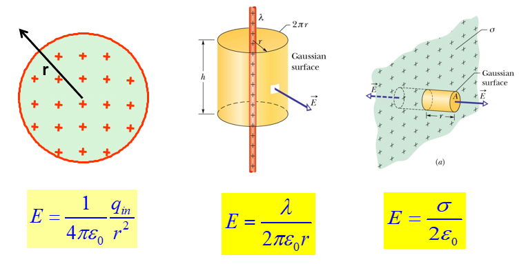
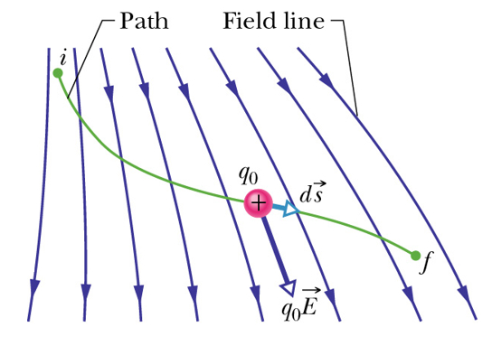
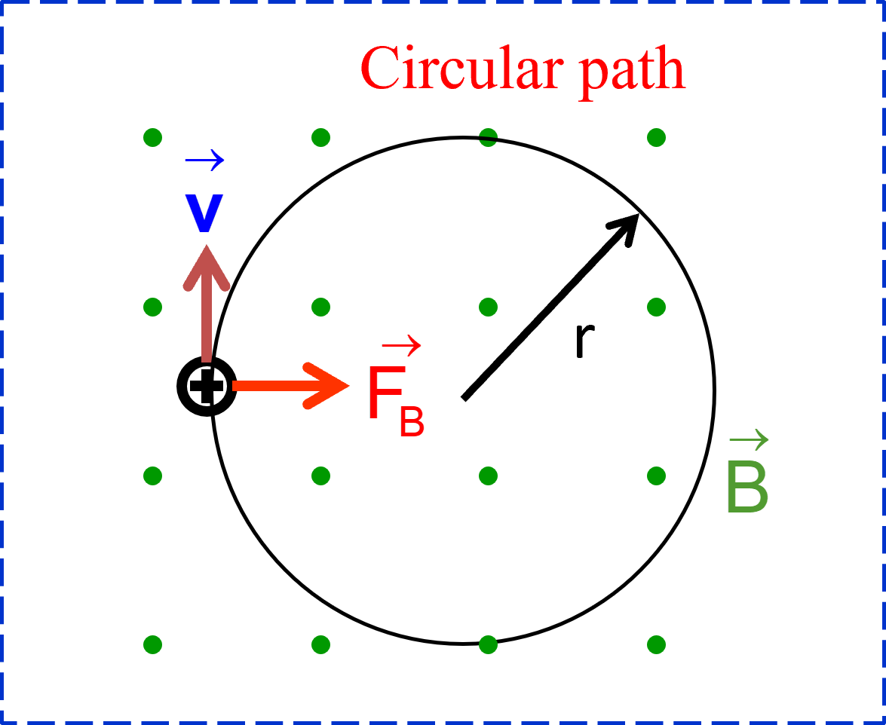
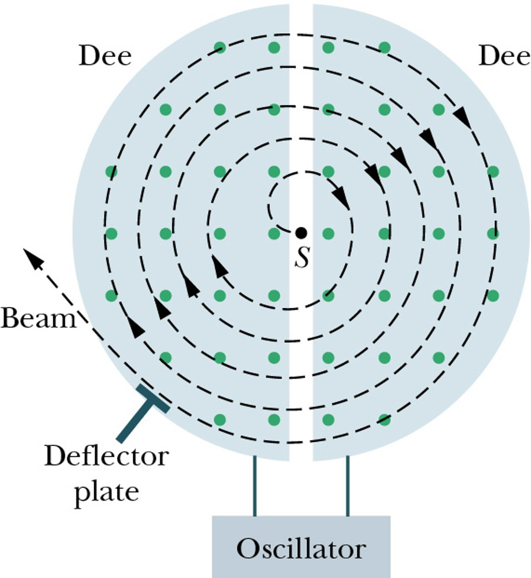

# General Physics III (2)

## PREFACE

- 请注意：本笔记仅仅包含 2024 年第二学期大学物理（Ⅲ）命题计划中的内容, 没有详细给出的部分并不代表不在教学范围内. 
- 带 * 的章节是可能对整章学习有影响, 但不在考纲中的内容. 

## Chapter 18 Temperature, Heat and 1st Law

## Chapter 19 Kinetic Theory of Gas

## Chapter 20 Entropy and 2nd Law

## Chapter 21 Coulomb's Law

### Electric Charge

An intrinsic characteristic of the fundamental particles. 基本粒子的内禀属性

- Two kinds of electric charge: Positive and Negative. 正负电荷

- Charges with the same electrical sign **repel** each other, opposite electrical signs **attract** each other. 同性相斥, 异性相吸

**Electrically neutral** 电中性

**Charged** 带电

元电荷: $e =1.602 176 487 \times 10^{-19} C$

电荷是量子化的: A physical quantity has only discrete values. 分立值, 即 $q = ne,\ n \in\mathbb{Z}$.

- 夸克带电 $\pm2/3$
- 质子带电 $+1$
- 中子不带电
- 电子带电 $-1$

**Charge is neither created nor destroyed **电荷不可产生消灭, **but it can be transferred from one** body to the other 电荷可传输.

In any process, the net algebraic sum of the amount of electric charge remains **constant**. 电荷量的代数和是常量. 

### Conductors and Insulators

Conductors: 绝缘体

Insulators: 导体

### Coulomb's Law

Two charged particles (point charges) at rest in a vaccum 对于真空中静止的两个点电荷 $q_1,q_2$, 若其距离为 $r$, 则有静电力
$$
F = k\frac{\vert q_1\vert\vert q_2\vert}{r^2}
$$
这就是 Coulomb's Law.

Electrostatic constant 静电常数: $k = 8.99\times 10^9N\cdot m^2\cdot C^{-2}$

Permittivity 介电常数: $\epsilon_0 = 8.85418781762\times10^{-12}N^{-1}m^{-2}C^2$, 满足 $\displaystyle k = \frac{1}{4\pi\epsilon_0}$.

**Shell theorem 1:** A shell of **uniform** charge attracts or repels a charged particle that is **outside** the shell as if all the shell’s charge were concentrated at its center. 壳外电荷受力等价于电荷聚集于球心对外电荷的作用力. 

If a charged particle is located **inside** a shell of uniform charge, there is **no net electrostatic force** on the particle from the shell. 壳内电荷不受静电力. 

## Chapter 22 Electric Fields

### Electric Field

Scalar fields **标量场**: temperature T(x,y,z); pressure p(x,y,z).

Vector fields **矢量场**: velocity of a fluid, gravitation.

电场强度的定义: We define the electric field of charged particle *q* at point P as: 
$$
\vec{E} = \frac{\vec{F}}{q_0} = \frac{1}{4\pi\epsilon_0}\frac{q}{r^2}\hat{r}
$$
At any point, the **tangent** of the electric field lines gives the **direction** of the electric field. **电场线的切线方向为该点的电场方向. ** 

The number of lines per unit area in a plane perpendicular to the lines (**density**) is proportional to the **magnitude** of the electric field. **电场线密度正比于电场强度. **

### Electric Field due to Point Charges

电场强度遵循矢量叠加原理: The electric field due to several particles can be calculated by the principle of superposition. 
$$
\vec{E_{net}} = \vec{E_1}+\vec{E_2}+\cdots+\vec{E_n} = \sum_{i=1}^{n}\frac{q_i}{4\pi\epsilon_0 r_i^2}\hat{r_i}
$$

### A Point Charge in an Electric Field

电场中的点电荷所受到的库仑力. When a charged particle is placed in an external electric field, the electrostatic force acts on the particle is 
$$
\vec{F} = q\vec{E}
$$
**Measuring the Elementary Charge – Millikan oil drop experiment 密立根油滴实验**

证明了元电荷 $e =1.602 176 487 \times 10^{-19} C$. 

## Chapter 23 Gauss' Law

### Electric Flux 

The flux of an electric field passing through an area element is
$$
\text{d}\Phi = \vec{E}\cdot\text{d}\vec{A}
$$
$\text{d}\Phi$ can be **positive**, **negative** or **zero** depending on the **direction of the vectors**. 

Flux through a surface: $\displaystyle \Phi = \iint\vec{E}\cdot\text{d}\vec{A}$

For a closed surface, outward is positive: $\displaystyle \Phi = \oiint \vec{E}\cdot\text{d}\vec{A}$

点电荷的电通量: A spherical **closed surface** with a point charge at its center: 
$$
\Phi = \oiint \vec{E}\cdot\text{d}\vec{A} = EA = 4\pi r^2\cdot E = 4\pi r^2\cdot \frac{1}{4\pi\epsilon_0}\frac{q}{r^2} = \frac{q}{\epsilon_0}
$$
It holds for any closed surface that encloses the charge **q** and for any location of q inside **A**.

### Gauss’ Law 

静电场中的高斯定理: 在真空中的任意静电场内, 通过任一闭合曲面S的电通量, 等于该闭合曲面所包围的电荷电量的代数和除以真空介电常数, 而与闭合曲面外的电荷无关.
$$
\Phi_e = \oiint \vec{E}\cdot\text{d}\vec{A} = \frac{1}{\epsilon_0}\sum{q_i} = \frac{q_{enc}}{\epsilon_0}
$$

### Electric Field of a Charged Conductor 

In electrostatic equilibrium, the electric field inside a conductor is zero. 静电平衡时**导体内部场强处处为零**. 

Excess charge on a conductor is entirely on the **conductor’s surface**. 多余电荷只能在表面. 

一个很经典的例子是, 若存在一个均匀的空心球体, 其内部有一个不在球心的点电荷, 那么无论该电荷在哪里, 最终球壳外表面上的电荷分布也是均匀的. 

对于一块均匀金属板, 其上带某种电荷, 那么取其上一个圆柱体, 其产生的电场强度如下
$$
\Phi_E = E\cdot A(\text{Left}) +E\cdot A(\text{Right}) = 2EA = \frac{q_{env}}{\epsilon_0} = \frac{\sigma_1 A}{\epsilon_0} \\
E_1 = \frac{\sigma_1}{2\epsilon_0}
$$
这是金属板单侧电荷产生的电场强度, 因此金属板两侧电荷产生的电场强度为
$$
E = 2E_1 = \frac{\sigma_1}{\epsilon_0} = \frac{\sigma}{2\epsilon_0}(\sigma = \pm2\sigma_1)
$$

对于上图中的两块带不同电荷的金属板, 其可以视为两个金属板所产生的电场的合成, 因此对于整体, 有
$$
E = 2\frac{\sigma_1}{\epsilon_0} = \frac{\sigma}{\epsilon_0}(\sigma = \pm2\sigma_1)
$$

### Electric Field of a Charged **Insulator** with Symmetry 

The Gaussian surface should match the symmetry of the charge so that to simplify the integral. 

以下是几种常见的对称情形电场强度

- **Spherically symmetric charges 球对称**

  

  对于均匀的空心金属球壳而言, 由于静电屏蔽, 其内部无电场强度, 而外部电场等价于球心处放置的点电荷所产生的电场, 因此有
  $$
  E = 
  \begin{cases}
  0 & r<R \\
  \displaystyle \frac{1}{4\pi\epsilon_0}\frac{1}{r^2} & r>R
  \end{cases}
  $$
  对于均匀的实心金属球体而言, 在 $r<R$ 时, 可以在 $r$ 处使用高斯定理, 此时有
  $$
  \oiint\vec{E}\cdot\text{d}\vec{A} = 4\pi r^2E = \frac{q'}{\epsilon_0} \\
  E = \frac{q'}{4\pi\epsilon_0r^2} = \frac{\frac{r^3}{R^3}q}{4\pi\epsilon_0r^2} = \frac{r}{4\pi\epsilon_0R^2}
  $$
  

  在 $r>R$ 时, 实心金属球体产生的外部电场等价于球心处放置的点电荷所产生的电场, 因此有
  $$
  E = 
  \begin{cases}
  \displaystyle (\frac{1}{4\pi\epsilon_0}\frac{q}{R^3})r & r<R \\
  \displaystyle \frac{1}{4\pi\epsilon_0}\frac{q}{r^2} & r>R
  \end{cases}
  $$

- **Cylindrically symmetric charges 柱对称**

  

  对于半径为 $R$, 均匀的带电金属棍, 研究其附近的圆柱形区域电场强度. 

  在 $r>R$ 时, 有
  $$
  \oiint\vec{E}\cdot\text{d}\vec{A} = 2\pi rh\cdot E = \frac{q}{\epsilon_0} = \frac{\lambda r}{\epsilon_0} \\
  $$
  在 $r<R$ 时, 有
  $$
  q' = \frac{r^2}{R^2}q
  $$
  因此, 就有
  $$
  E =
  \begin{cases}
  \displaystyle \frac{\lambda}{2\pi\epsilon_0 r} & r>R \\
  \displaystyle \frac{\lambda r}{2\pi\epsilon_0 R^2}  & r<R
  \end{cases}
  $$

- **Planar symmetric charges 平面对称**

  

  如图所示, 选取关于平面对称的圆柱体作为高斯面, 就有
  $$
  E = \frac{\sigma}{2\epsilon_0}
  $$
  参考[此处](#Electric Field of a Charged Board). 

## Chapter 24 Electric Potential

### Electric Potential & Potential Energy

Electric force is **conservative** and thus has an associated **potential energy**.

**Conservative Forces** is path independent and always have **zero curl** $\nabla\times\vec{F} = 0$. 

Circuital theorem of electrostatic field **环路定理**

The difference of the electric potential energy of a system changing from an initial configuration to a final configuration is related to the work done *W* by the **electrostatic force** on the system by
$$
\Delta{U} = U_f-U_i = -W
$$
The potential energy per unit charge at a point in an electric field set up by other objects is called the **electric potential** of the field.
$$
V = \frac{U}{q} \\
\Delta{V} = V_f - V_i = -\int_{i}^{f}\vec{E}\cdot\text{d}\vec{s}
$$
Electrostatic force is the negative gradient of electric potential energy.
$$
\vec{F} = -\nabla U = -\left(\frac{\partial U}{\partial x}\vec{i}+\frac{\partial U}{\partial y}\vec{j}+\frac{\partial U}{\partial z}\vec{k}\right)
$$
Electric field is the negative gradient of electric potential.
$$
\vec{E} = -\nabla V = -\left(\frac{\partial V}{\partial x}\vec{i}+\frac{\partial V}{\partial y}\vec{j}+\frac{\partial V}{\partial z}\vec{k}\right)
$$
And we have
$$
\vec{F} = q\vec{E} \\
U = qV
$$
电势的单位是电子伏特 electron-volt. $1eV = 1.60\times 10^{-19}J$. 

No work is done on a charged particle by the electric field when the particle moves between two points on the **same equipotential surface**. 同一等势面上的移动不做功. 

The same work is done by the field on a charged particle over any path connecting **two equipotential surfaces**. 跨越不同等势面的移动做工相同. 

**Equipotential surface** must be **perpendicular** **to the electric field,** otherwise a charge will experience an electric force parallel to the surface and there is work done by the electric field on the same surface. 等势面垂直于电场线. 

### Electric Potential due to Point Charges

**Potential due to a point charge** **单点电荷的电势**

在距离点电荷 $r$ 处, 有
$$
E(r) = \frac{q}{4\pi\epsilon_0r^2} \\
V(r) = -\int E(r)\text{d}r = \frac{q}{4\pi\epsilon_0r}, V(\infty) = 0
$$
**Potential due to several point charges** **多点电荷的电势**

简单来说, 带电体系静电场中一点的电势等于每一点电荷单独存在时在该点的电势的代数和. 也就是说
$$
V(r_1,r_2,\cdots,r_n) = \frac{1}{4\pi\epsilon_0}\sum_{i=1}^{N}\frac{q_i}{r_i}
$$

### Calculating Potential from Field

**Work** done by the field on a charge. 
$$
\text{d}W = \vec{F}\cdot\text{d}\vec{s} = q_0\vec{E}\cdot\text{d}\vec{s}
$$
The change of the **potential energy**
$$
\Delta{U} = -q_0\int_{i}\vec{E}\cdot\text{d}\vec{s}
$$
对于均匀的实心金属球而言(参考[此处](#Spherically symmetric charges)), 其电势和电压如下

$$
V(r) = 
\begin{cases}
\displaystyle -\int_{\infty}^{r}\frac{q}{4\pi\epsilon_0 r^2}\text{d}r &= \displaystyle \frac{q}{4\pi\epsilon_0 r} & r>R\\
\displaystyle -\int_{\infty}^{R}\frac{q}{4\pi\epsilon_0 r^2}\text{d}r - \int_{R}^{r}0\text{d}r &= \displaystyle \frac{q}{4\pi\epsilon_0 R} & r<R\\
\end{cases}
$$

### Calculating Field from Potential

The electric field is perpendicular to the equipotential surfaces and points to the direction in which the **potential decreases.**
$$
\text{d}V = -E\text{d}s \\
E = -\frac{\partial V}{\partial s}
$$
梯度计算参考[此处](#Calculate Electric Field by Gradient). 

## Chapter 25 Capacitance

### Capacitor and Capacitance

A **capacitor** is a device in which **electrical energy** is **stored**. It consists of two isolated conductors (plates) with insulating material between them. 

The capability of **how much charge** a capacitor can store is called **capacitance**.
$$
C = \frac{q}{V_{ab}}
$$
电容的单位是法[拉], 有 $1F = 1C/V$, 微法 $1\mu F = 10^{-6}F$, 皮法 $1pF = 10^{-12}F$. 

### Calculating Capacitance

The **capacitance** of a capacitor does **not depend on** the potential difference **nor on** the charge of the capacitor. **电容是本征材料和结构决定的, 与外加电压和充电电量无关. **

- 对于**平行板电容器 Parallel-Plate Capacitor**, 有

  $$
  E = \frac{\sigma}{\epsilon_0} = \frac{1}{\epsilon_0}\frac{q}{A} \\
  V = Ed = \frac{1}{\epsilon_0}\frac{q}{A}d \\
  C = \frac{q}{V} = \epsilon_0\frac{A}{d}
  $$

- 对于**柱状电容器 Cylindrical Capacitor**, 有

  $$
  E(r) = \frac{q}{2\pi\epsilon_0 rL} \\
  V = \int_{a}^{b}\frac{q}{2\pi\epsilon_0rL}\text{d}r = \frac{q}{2\pi\epsilon_0L}\ln(b/a) \\
  C = \frac{q}{V} = 2\pi\epsilon_0\frac{L}{\ln(b/a)}
  $$
  
  其中 $E(r)$ 的表达式可以参考[此处](#Cylindrically symmetric charges). 

- 对于**球状电容器 Spherical Capacitor**, 有
  
  $$
  E(r) = \frac{q}{4\pi\epsilon_0 r^2} \\
  V = \int_{a}^{b}E(r)\text{d}r = \frac{q}{4\pi\epsilon_0}(\frac{1}{a}-\frac{1}{b}) \\
  C = \frac{q}{V} = 4\pi\epsilon_0\frac{ab}{b-a}
  $$
  
  其中 $E(r)$ 的表达式可以参考[此处](#Spherically symmetric charges). 

### Capacitors in Parallel and in Series

- 并联 Parallel

  

  此时分析电路, 有 $V = V_1 = V_2 = V_3, q = q_1 + q_2 + q_3$, 可以得到
  $$
  C_{eq} = C_1+C_2+C_3
  $$

- 串联 Capacitors in Series 

  
  
  此时分析电路, 有 $V = V_1+V_2+V_3, q = q_1=q_2=q_3$,  可以得到
  $$
  \frac{1}{C_{eq}} = \frac{1}{C_1}+\frac{1}{C_2}+\frac{1}{C_3} = \sum_{i}^{n}\frac{1}{C_i}
  $$

### Energy of Electric Field

To charge a capacitor and store electric potential energy in it, **work** must be **done** by an **external force**.
$$
\text{d}W = V\text{d}q = \frac{q}{C}\text{d}q \\
W = \int_{0}^{q}\frac{q}{C}\text{d}q = \frac{q^2}{2C} \\
U = W = \frac{1}{2}qV = \frac{1}{2}CV^2
$$
**Energy density** **of an electric field** **能量密度** 
$$
u = \frac{U}{V_{volume}} = \frac{\frac{1}{2}CV^2}{Ad} = \frac{\frac{1}{2}(\epsilon_0\frac{A}{d})(Ed)^2}{Ad} = \frac{1}{2}\epsilon_0E^2
$$

### **Capacitor with a Dielectric* ** 

When a dielectric is inserted into a capacitor, its capacitance is increased by a factor called dielectric constant $\kappa$ (kappa).**电介质插入双极板, 电容以介电常数倍增加. **也就是说, 在插入介质之后, 电容变化是 $C\to\kappa C$. 

**Dielectric strength** $E_{max}$ 介电强度: The maximum electric field of a dielectric it can tolerate without breakdown. 最大击穿场强. 

In a region completely filled by a dielectric, all electrostatic equations containing permittivity constant $\epsilon_0$ are to be replaced with $\kappa\epsilon_0$. 在电介质完全填充的区域, 需要将 $\epsilon_0$ 全部替换成 $\kappa\epsilon_0$. 也就是说, 对于介质中的电场, 其需要进行 $\displaystyle E\to\frac{E}{\kappa}$ 的变换. 

### **Gauss’ Law in Dielectric***

## Chapter 26 Current and Resistance

## Chapter 27 Circuits

## Chapter 28 Magnetic Fields

### Magnet and Magnetic field 

磁体主要可分为两种, **Permanent magnet** 永磁体和 **Electromagnet** 电磁体. 

An **electron** has an intrinsic magnetic field. **电子具有内禀磁场.** 

The vector sum gives a net magnetic field. **矢量和表现为净磁场. **

Electric **current** (moving charged particles) produces magnetic fields. **运动的带电粒子产生磁场. **

磁感应强度 **magnetic induction** 反应磁场的大小, 其满足如下方程
$$
\vec{F_B} = q\vec{v}\times\vec{B}
$$
磁场力的方向遵循右手定则. 

磁感应强度的单位是 **Tesla 特斯拉** 和 **Gauss 高斯**. 

$1T = 1N\cdot s\cdot C^{-1}\cdot m^{-1} = 1N\cdot A^{-1}\cdot m^{-1}$

$1T = 10^4 G$

磁感线的方向. At any point, the **tangent** of a *magnetic field line* gives the **direction** of the magnetic 

磁感应强度的大小. The **number** of *lines per unit area* in a plane perpendicular to the magnetic field lines is proportional to the **magnitude** of the magnetic field. field.

对于地磁场而言, 地球的北极是地磁的南极, 地球的南极是地磁的北极. 

### Circular motion of a charged particle

In a magnetic field, a charged particle moves in a circular path if the initial velocity is perpendicular to the magnetic field. 圆周运动. 

对于此种情形, 我们可以列出
$$
F_B = ma \\
\vert q\vert vB = m\frac{v^2}{r} \\
$$
那么就会得到
$$
\begin{array}{rlrl}
\text{Angular velocity} & \displaystyle \omega = \frac{v}{r} = \frac{\vert q\vert B}{m} & \text{Radius} & \displaystyle r = \frac{mv}{\vert q\vert B} \\
\text{Period} & \displaystyle T = \frac{2\pi r}{v} = \frac{2\pi m}{\vert q\vert B} & \text{Frequency} & \displaystyle f = \frac{1}{T} = \frac{\vert q\vert B}{2\pi m}
\end{array}
$$
If the velocity of a charged particle has a component parallel to the uniform magnetic field, the particle will move in a helical path. **速度分量分别平行和垂直电场, 螺旋线运动. **

The velocity’s parallel component determines the **pitch p** (**螺距**) of the helix. 

The perpendicular component determines the **radius** (**半径**)of the helix.
$$
p = v_{\parallel}T = (v\cos{\phi})\frac{2\pi m}{\vert q\vert B} \\
r = \frac{m v_{\perp}}{\vert q\vert B} = \frac{m(v\sin\phi)}{\vert q\vert B}
$$
 **Cyclotrons and Synchrotrons** **回旋加速器, 同步加速器**

The frequency which the proton circulates in the field must be equal to that of the electrical oscillator: $f = f_{osc} = \vert q\vert B/2\pi m$ (resonance condition) 共振条件：质子回旋频率等于电势振荡频率. 

When the proton is energized to above 50MeV, the conventional cyclotron begins **to fail**. 回旋加速有能量极限. 

According to the relativity theory, the proton’s mass increases and the frequency of revolution decreases. 相对论效应, 高速运动质子质量增加, 回转频率会越来越慢. 

The synchrotron is designed to solve this difficulty. The magnetic field increases with the energy so that the resonance condition is satisfied. 磁场逐级增强, 以匹配共振条件. 

### Crossed fields

Both **electric field** and **magnetic field** can produce a force on a charged particle. When the two fields are **perpendicular to** each other, they are said to be **crossed fields**. 正交场. 

**Measurement of charge-to-mass ratio of an electron** **荷质比** $\displaystyle \frac{q}{m}$

**The Hall effect** **霍尔效应**

The direction of the **Hall electromotive force (**电动势 emf**)** can be used to differentiate the **sign** of charge **carriers**. 区分载流子的电性

$$
F_e = eE_H \\
F_m = ev_dB \\
F_e = F_m \Rightarrow E_H = v_dB \\
\text{Electric Field: }v_d = \frac{J}{ne} = \frac{i}{neA} \text{ and } v_d = \frac{E_H}{B} \Rightarrow E_H = \frac{Bi}{neA} \\
\text{Hall Potential Difference: }V_H = E_Hd = \frac{Bid}{neA} = \frac{Bi}{nel} \\
\text{Number density: } n = \frac{Bi}{V_H le} \\
\begin{array}{rl}
&J:\text{the current density 电流密度} \\
&A:\text{the cross-sectional area 横截面积} \\
&n:\text{the number density of charge carriers 载流子数密度} \\
&l:\text{thickness of the strip 样条厚度}
\end{array}
$$

### Magnetic force on current-carrying wire

Consider a length L of the wire. The conduction electrons in wire will drift in a time $t = L/v_d$, thus a charge $q = iL/v_d$ will pass through the plane.

Magnetic force on the section 
$$
F_B = qvB\sin\phi = i\frac{L}{v}vB\sin\phi = iLB\sin\phi \\
\vec{F_B} = i\vec{L}\times\vec{B}
$$
If **the wire is not straight** or the **magnetic field is not uniform**, We can imagine breaking the wire into **small segments** and apply (**微分形式**)
$$
\text{d}\vec{F_B} = i\text{d}\vec{L}\times\vec{B}
$$
The total force on the wire 
$$
\vec{F_B} = \int\text{d}\vec{F_B}
$$

## Chapter 29 Magnetic fields due to currents

### Biot-Savart law*

A moving charged particle produces a magnetic field. **动电荷产生磁场** 

An electric current produces a magnetic field. **电流产生磁场**

The magnetic field $B$ produced at point $P$ by length $\text{d}s$ of the wire with current $i$ is given by the **Biot-Savart law:**
$$
\text{d}\vec{B} = \frac{\mu_0}{4\pi}\frac{i\text{d}\vec{s}\times\hat{r}}{r^2} \\
\hat{r} = \frac{\vec{r}}{r}
$$
**Permeability** **in vacuum** **真空磁导率** $\mu_0 = 4\pi\times10^{-7}TmA^{-1}$

### Calculating Magnetic Fields by B-S Law*

### Calculating magnetic fields by Ampere's law

和高斯定理类似, 安培定理表明, 在真空中载流导线所载有的稳恒电流, 与磁感应强度沿着环绕导线的任意闭合环路的路径积分, 两者之间的关系为

$$
\oint_C\vec{B}\cdot\text{d}\vec{l} = \mu_0i_{enc}
$$
其中 $C$ 是环绕着导线的闭合环路, $\text{d}\vec{l}$ 是微小线元矢量. 

Magnetic field has a nonzero curl. 磁场是有旋场. 

Derivation from the magnetic filed of an infinite current carrying wire. 以下是不同情况下无穷长导线的安培电流大小. 

- a. Circular loop with current enclosed 圆环包络电流
  $$
  \oint_L\vec{B}\cdot\text{d}\vec{l} = \oint_LB\text{d}l = 2B\pi R = \mu_0I
  $$

- b. Arbitrary loop with current enclosed 随机环包络电流
  $$
  \oint_L\vec{B}\cdot\text{d}\vec{l} = \oint_LB\cos\theta\text{d}l = \int Br\text{d}\phi = \int_0^{2\pi}\frac{\mu_0I}{2\pi r}r\text{d}\phi = \mu_0I
  $$

- c. Current wire is not enclosed 电流在环路之外
  $$
  \text{On }L_1: \vec{B}\cdot\text{d}\vec{l} = Br\text{d}\phi \\
  \text{On }L_1: \vec{B}\cdot\text{d}\vec{l} = -Br\text{d}\phi \\
  \oint_L\vec{B}\cdot\text{d}\vec{l} = \oint_{L_1}\vec{B}\cdot\text{d}\vec{l} + \oint_{L_2}\vec{B}\cdot\text{d}\vec{l} = \frac{\mu_0I}{2\pi}\oint_{L_1}\text{d}\phi - \frac{\mu_0I}{2\pi}\oint_{L_2}\text{d}\phi = \frac{\mu_0I}{2\pi}[\phi-\phi] = 0
  $$

- d. More current wires 多个导线

  Superposition principle of magnetic fields. 叠加原理.

**Right-hand rule**

安培电流的方向使用右手定则判断. 

**Magnetic field of a long straight wire**

- Outside the wire 导线外
  $$
  \int_L\vec{B}\cdot\text{d}\vec{l} = \mu_0l\quad B\cdot 2\pi r = \mu_0 l \\
  B = \frac{\mu_0I}{2\pi r} \\
  $$
- Inside the wire 导线内
  $$
  I_{in} = \frac{r^2}{R^2}I \\
  B = \frac{\mu_0I}{2\pi}\frac{r}{R^2}
  $$
  
- 

因此磁感应强度的分布如下

### Solenoids 

A long highly wound helical coil “**长、直、密绕**”线圈成螺线管. 

Outside: $B=0$.

Inside: $B$ is uniform 匀强

对其进行分析, 有
$$
\oint_L\vec{B}\cdot\text{d}\vec{l} = \int_a^{b}\vec{B}\cdot\text{d}\vec{l} + \int_b^{c}\vec{B}\cdot\text{d}\vec{l} + \int_c^{d}\vec{B}\cdot\text{d}\vec{l} + \int_d^{a}\vec{B}\cdot\text{d}\vec{l} = Bl_{ab} \\
\mu_0i_{enc} = \mu_0\sum_{L}I_i = \mu_0nl_{ab}I
$$
其中 $n$ 是单位长度上的线圈匝数, 应用安培定理可以得到
$$
Bl_{ab} = \mu_0nl_{ab}I \\
B = \mu_0 nI
$$
The magnetic field magnitude B within a solenoid: 

- Not depend on the diameter or the length of the solenoid. 

- Uniform over the solenoidal cross section. 

## Chapter 30 Induction and Inductance

### Faraday's Law of Induction

An electromotive force (**emf** **电动势**) is induced in a loop when the **magnetic flux** is changing. 线圈磁通量变化产生电动势. 

**Magnetic flux 磁通量**
$$
\Phi_B = \iint\vec{B}\cdot\text{d}\vec{A}
$$
磁通量单位是**韦伯 Wb**, $1Wb = 1T\cdot m^2$. 

The magnitude of the **emf** induced in a conducting loop is equal to the **rate** at which the **magnetic flux** through that loop changes with time. 产生电动势正比于磁通量变化率. 

法拉第电磁感应定律的表述如下
$$
E = -\frac{\text{d}\Phi_B}{\text{d}t}
$$
Magnetic flux through a coil of N turns 对于 $N$ 匝线圈, 其磁通量是 $\displaystyle -N\frac{\text{d}\Phi_B}{\text{d}t}$. 

The **emf** tends to **oppose** the magnetic **flux change.** (Lenz’s law) **电动势的变化趋势与磁通量的变化趋势相反. **

By **Lenz’s law**, whether you move the magnet *toward or away* from the loop, a **magnetic force resists the motion**, requiring your **applied force to do positive work**. The work is transferred to energy. 

Consider a resistance circuit, we find magnetic field is uniform and perpendicular to the plane of the loop. 
$$
\Phi_B = BLx
$$
The flux through the loop is changing with time.
$$
E = \frac{\text{d}\Phi_B}{\text{d}t} = \frac{\text{d}}{\text{d}t}(BLx) = BLv \\
i = \frac{E}{R} = \frac{BLv}{R}
$$
Magnetic force on a current-carrying wire and power. 
$$
F_{app} = F_1 = iBL \\
P = F_{app}v = iLBv = \frac{B^2L^2v^2}{R}
$$

### Inductor and Inductance

An inductor is a device that can be used to produce a magnetic field in a specified region. 电感用于产生磁场（电生磁）. 

An inductor is a circuit element that stores energy in the magnetic field, just as a capacitor stores energy in the electric field. 存储磁能. 

If a current $i$ is established through each of the $N$ windings of an inductor, a magnetic flux $\Phi_B$ links those windings. The inductance $L$ of the inductor is
$$
L = \frac{N\Phi_B}{i}
$$
其中 $N$ 是线圈匝数, $N\Phi_B$ 是 magnetic flux linkage 磁通链. 

电感的单位是**亨利(Henry)**, $1H = 1T\cdot m^2/A$. 

**Inductance of a long solenoid**

参考[此处](#Magnetic Field of a Solenoid), 有 
$$
B = \mu_0 ni \\
\Phi_B = BA \\
N\Phi_B = (nl)(\mu_0 ni)A = \mu_0n^2ilA \\
$$
那么就能得到 
$$
L = \frac{N\Phi_B}{i} = \mu_0 n^2lA \\
\frac{L}{l} = \mu_0n^2 A
$$
**Self-Induced emf 自感电动势**

If we change the current, an induced **emf** will appear in the coil . This emf is called self-induced emf. 

结合 $N\Phi_B = Li$ 和法拉第电磁感应定律 $\displaystyle \epsilon_L = -N\frac{\text{d}\Phi_B}{\text{d}t}$, 可以得到自感电动势的表达式
$$
\epsilon_L = -L\frac{\text{d}i}{\text{d}t}
$$
**自感电动势阻碍电流变化. **

**Mutual Induction** **互感**

The current $i_1$ in coil 1 creates a magnetic field. Some of the magnetic field lines pass through coil 2, and the magnetic flux caused by the current in coil 1 and passing through coil 2 is $N_2\Phi_{21}$. 

For coil1, we have $\displaystyle M_{12} = \frac{N_1\Phi_{12}}{i_2}$, and for coil 2, we have $\displaystyle M_{21} = \frac{N_2\Phi_{21}}{i_1}$. 

那么互感系数就是
$$
M = M_{12} = M_{21}
$$

## Chapter 31 Electromagnetic Oscillations and AC

## Chapter 32 Maxwell's equations

### Induced Magnetic Field

### Displacement Current

### Maxwell’s Equations

## Chapter 33 Electromagnetic Waves

### Electromagnetic Waves

### Energy Transport and Poynting Vector

## Chapter 37 Relativity

### The Relativity of Time

### The Relativity of Length

### The Lorentz Transformation

### Momentum and Energy

## Chapter 38 Photons and Matter Waves

### Photoelectronic effect

### Compton scattering

### Schrodinger's Equation

## Chapter 39 More about Matter Waves

### 1D Infinite Potential Well

### Hydrogen Atom

## Chapter 40 All about Atoms

### Orbital Angular Momentum

### Spin Angular Momentum